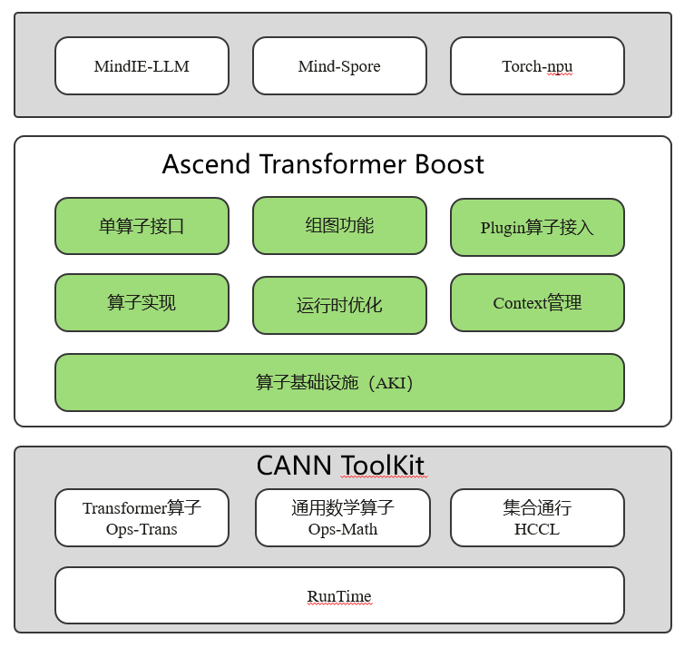

# Ascend Transformer Boost

## 介绍
Ascend Transformer Boost加速库（下文简称为ATB加速库）是一款基于华为Ascend AI处理器，专门为Transformer模型的训练和推理而设计的加速库。主要包含一系列Transformer模型算子和运行时优化措施， 提高模型性能。

高性能算子：针对昇腾系列芯片， 提供高度优化的Transformer算子， 包括Linear/softmax/PageAttention/RingAttention等。
组图能力： 支持通过手动构图方式将上述算子或用户自定义算子构建成图算子，用于表征Layer或Model。
运行时优化： 通过算子间内存复用和算子下发顺序优化， 提升整体模型性能。
Plugin： 提供Plugin能力， 支持用户使用第三方算子组图。

## 软件架构
加速库接能主要分成三部分：



ATB的架构大致可以分成3层：
1. 接口层： 提供单算子接口、组图接口、PlugIn算子接入接口三类
2. 功能实现层：包括算子实现、运行时优化、Context管理等
3. 算子运行时：主要提供算子分包、下发等功能。

## 环境构建
    - [安装CANN环境](https://www.hiascend.com/document/detail/zh/canncommercial/80RC22/softwareinst/instg/instg_0001.html?Mode=PmIns&OS=Ubuntu&Software=cannToolKit)
    - 设置cann环境变量
    ```sh
    source [cann安装路径]（默认为/usr/local/Ascend/ascend-toolkit）/set_env.sh
    ```

## 使用教程
   用户可以选择从源码编译安装，也可以通过官网下载版本包安装。 下面的安装方式2选1.
   前置条件：已经在环境上安装了对应的CANN ToolKit包。 安装步骤见：https://www.hiascend.com/document/detail/zh/canncommercial/82RC1/softwareinst/instg/instg_quick.html?Mode=PmIns&InstallType=local&OS=Debian&Software=cannToolKit

 - 源码编译并安装<br>
    注意： ATB是CANN的标准组件， 提供标准的安装包供用户使用。如果希望使用已经编译好的标准包， 可以跳过这一步骤。
    编译加速库，设置加速库环境变量：
    ```sh
    > cd ascend-transformer-boost
    > bash scripts/build.sh # 编译
    > source output/atb/set_env.sh #安装
    ```

 - ATN安装使用<br>
    - run包获取
    1. 进入网址：https://www.hiascend.com/developer/download/commercial
    2. 产品系列选择服务器，产品型号根据设备型号选择，选择所需解决方案版本，随后在CANN区域选择软件包跟随指引即可获取相关run包
    - 软件包名为：Ascend-cann-atb_{version}_linux-{arch}.run <br>
    其中，{version}表示软件版本号，{arch}表示CPU架构。
    - 安装run包（需要依赖cann环境）
        ```sh
        chmod +x Ascend-cann-nnal_<version>_linux-<arch>.run # 增加对软件包的可执行权限
        ./Ascend-cann-nnal_<version>_linux-<arch>.run --check # 校验软件包安装文件的一致性和完整性
        ./Ascend-cann-nnal_<version>_linux-<arch>.run --install --whitelist=atb # 安装软件，可使用--help查询相关安装选项
        ```
        出现提示`xxx install success!`则安装成功

## 使用说明
- 单算子调用
    ```
    #include <acl/acl.h>
    #include <atb/atb_infer.h>
    
    int deviceId = 0;
    aclError status = aclrtSetDevice(deviceId);
    // 以elewise大类中的Add算子为例，可通过以下方式构造对应参数：
    atb::infer::ElewiseParam param;
    param.elewiseType = atb::infer::ElewiseParam::ELEWISE_ADD;
    // 创建算子对象实例
    atb::Operation *op = nullptr;
    atb::Status st = atb::CreateOperation(param, &op);
    
    // Tensor构造方法
    atb::Tensor a;
    a.desc.dtype = ACL_FLOAT16;    // 配置Tensor数据类型
    a.desc.format = ACL_FORMAT_ND; // 配置Tensor格式
    a.desc.shape.dimNum = 2;       // 配置Tensor维度数
    a.desc.shape.dims[0] = 3;      // 配置Tensor第0维大小
    a.desc.shape.dims[1] = 3;      // 配置Tensor第1维大小
    a.dataSize = Utils::GetTensorSize(a); // 获取Tensor内存大小
    status = aclrtMalloc(&a.deviceData, a.dataSize, ACL_MEM_MALLOC_HUGE_FIRST); // 申请device内存
    // 按上述方法构造所有输入和输出tensor，存入VariantPack
    atb::VariantPack variantPack;
    variantPack.inTensors = { a, ... };
    variantPack.outTensors = { output, ... };
    
    atb::Context *context = nullptr;
    st = atb::CreateContext(&context);
    aclrtStream stream = nullptr;
    status = aclrtCreateStream(&stream);
    context->SetExecuteStream(stream);
    
    // 调用Setup接口，计算workspace大小。
    uint64_t workspaceSize = 0;
    st = op->Setup(variantPack, workspaceSize, context);
    
    // 根据workspace大小申请NPU内存。
    void *workspace = nullptr;
    status = aclrtMalloc(&workspace, workspaceSize, ACL_MEM_MALLOC_HUGE_FIRST);
    
    // 调用Execute接口，执行算子。
    st = op->Execute(variantPack, (uint8_t *)workspace, workspaceSize, context);
    
    // 销毁创建的对象，释放内存。
    status = aclrtDestroyStream(stream); // 销毁stream
    status = aclrtFree(workspace);       // 销毁workspace
    st = atb::DestroyOperation(op);      // 销毁op对象
    st = atb::DestroyContext(context);   // 销毁context
    // 下面代码为释放Tensor的示例代码，实际使用时需释放VariantPack中的所有Tensor
    status = aclrtFree(tensor.deviceData);
    tensor.deviceData = nullptr;
    tensor.dataSize = 0;
    
    ```

## 参与贡献
 
1.  新建 br_personal/[employee_id]/[branch_name] 分支
2.  提交代码
3.  新建 merge Request

## 样例安全声明
`example`目录下的样例旨在提供快速上手、开发和调试ATB特性的最小化实现，其核心目标是使用最精简的代码展示ATB核心功能，**而非提供生产级的安全保障**。与成熟的生产级使用方法相比，此样例中的安全功能（如输入校验、边界校验）相对有限。

ATB不推荐用户直接将样例作为业务代码，也不保证此种做法的安全性。若用户将`example`中的示例代码应用在自身的真是业务场景中且发生了安全问题，则由用户自行承担。

## 参考文档
**[CANN商用版文档](https://www.hiascend.com/document/detail/zh/canncommercial/80RC2/quickstart/quickstart/quickstart_18_0001.html)**
**[ATB商用版文档](https://www.hiascend.com/document/detail/zh/canncommercial/80RC2/developmentguide/acce/ascendtb/ascendtb_0001.html)**