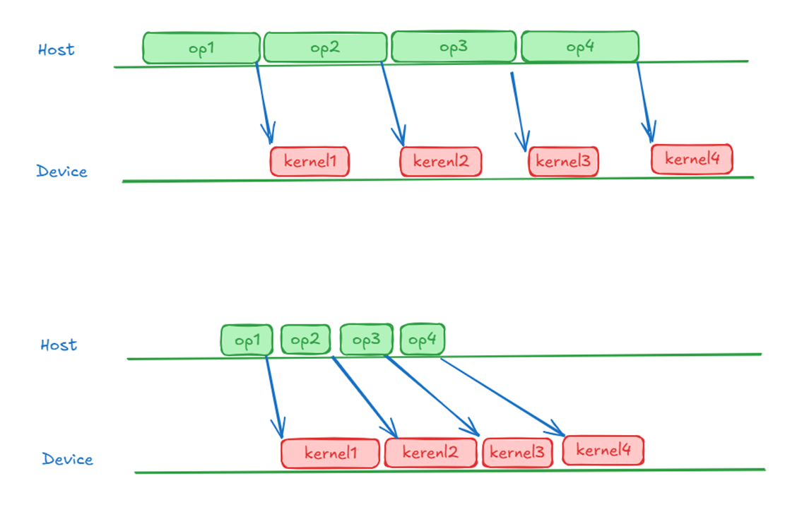

# ATB Mechanisms

## Operator Dispatch

A deep learning model can be abstracted as a computation graph composed of individual operators. Nodes represent operators, and edges represent tensor data dependencies. During model training and inference, the main program executes on CPUs. During this process, operators are dispatched one by one to devices (NPUs or GPUs) for execution, with synchronization performed when necessary. The entire process can be abstracted as shown in the following figure:



### Two Types of Performance Bottlenecks

Since preparing the operator context and dispatching operators on the host also takes time, two types of performance bottlenecks can occur in this working mode:

- Host Bound: The host dispatches operators slowly, but the device (NPU) executes operators quickly. The host execution efficiency becomes the performance bottleneck. In the profiling trace, this appears as bubbles between kernels on a stream. In this case, device compute is not fully utilized. The host program needs optimizations to accelerate operator dispatch.

- Device Bound: The host dispatches operators quickly, but the device executes operators slowly. The device execution efficiency becomes the performance bottleneck. In this case, device compute has been fully utilized. To further improve performance, consider optimizing the kernel.

The preceding figure shows examples of the two types of performance bottlenecks.

### Operator Dispatch Process

The dispatch process of a single operator can be simplified as follows:
<!--

-->
1. Validity Check

    Check whether the operator inputs, outputs, and parameters meet the operator requirements to prevent errors caused by incorrect parameters submitted to the device.

2. Output Shape Inference (Infer Shape): Infer the output shape and data type from the input shape and data type of the operator.
<!--
    
-->
    For example, for a simple Matmul operator, if the shape of the left matrix is `M * K` and the shape of the right matrix is `K * N`, the shape of the output matrix can be inferred as `M * N`.

3. Tiling

    In most cases, a single AI Core can only process a limited amount of data at a time. The operator's input data cannot be fully loaded at once to complete the computation. The input must be partitioned into multiple blocks, and the computation is completed block by block. This process is called tiling, and the algorithm for partitioning the data is called the tiling algorithm or tiling policy.

    For complex operators, each kernel implementation may have its own tiling algorithm: it determines how to partition data during kernel execution based on the input/output tensor shapes and other information. The result of this computation is typically stored in a custom tiling data structure.
<!--
    
-->
    The preceding figure shows a tiling policy for matrix multiplication (Matmul):

    - First, perform multi-core tiling on M, K, and N dimensions based on the current number of cores to obtain the shape sizes within a single core, namely, singleCoreM, singleCoreK, and singleCoreN.

    - Then, perform intra-core tiling. Further partition the per-core shapes based on the size constraints of the local memory to obtain the shape sizes baseM, baseN, and baseK of matrices A, B, and C involved in a single matrix multiplication instruction.

    ATB saves the tiling policy in a structure, which is later passed to the operator kernel function. In this sample, it is `struct matmulTilingData`.

    ```cpp
    struct matmulTilingData {
        uint singleCoreM;
        uint singleCoreK;
        uint singleCoreN;
        uint baseM;
        uint baseK;
        uint baseN;
    }
    ```

    Tiling policies have a great impact on the performance of complex operators. The same operator can have a 10x performance difference under different tiling policies.

4. Obtaining Workspace Size

    Operators sometimes require additional HBM for data exchange or caching. This space is called the operator's workspace. It needs to be allocated before the operator actually executes.
<!--
    
-->
    In the preceding sample, matrix multiplication is performed first, followed by a Reduce operation. A workspace is required to temporarily store the result of the matrix multiplication.

5. Workspace Allocation

    For two-stage operator interfaces like ATB and aclnn, this step is generally performed by the execution framework (such as torch-npu) rather than implemented inside the operator. This allows an external framework to manage HBM resources throughout model execution, improving allocation efficiency.

6. Operator Dispatch

    Package the previously prepared input/output tensor addresses, tiling information, workspace address memory space, and other parameters into an argument list. Call the Launch Kernel interface to notify the device to execute the kernel according to the above parameters.
<!--
    
-->
## ATB Mechanisms

As models become increasingly complex with more and more operators, the aforementioned Host Bound gradually becomes apparent. To address this issue, ATB has implemented targeted optimizations. It provides the following features:
<!--

-->
1. Customized fused operators: Commonly used operators for Transformer structures are available, such as PageAttention and Linear. Operators provided by the ATB are typically carefully designed fused operators for popular models, offering high performance.

2. Lightweight graph building: You can build graphs using the above operators or third-party operators, and then operating on the graph as if it were a single operator. These are called graph operators below. Graph operators can be easily reused across different models and different layers.

3. Runtime optimization: Multiple optimization solutions help improve host performance and reduce device memory usage. The details are as follows:
    - Tiling cache: Caches computed tiling results to reduce repeated computation.
    - Scheduling optimization: Optimizes the operator dispatch in graph mode, allowing operators on the device to run without gaps to solve Host Bound.
    - Memory optimization: Utilizes a memory allocation algorithm based on memory block splitting, merging, and tail block optimization to reuse intermediate tensors inside graph operators. This saves an average of 50% of workspace and increases the maximum batch size for model inference.

### Graph Building Sample

For details, see the `CreateLlamaMlpOperationByGraphOpBuilder` function in `tests/framework/c++/layer_ops/llama65b/layer/llama65b_layer_mlp_graph_builder.cpp`.
The following shows only the body of the graph building logic.

```cpp
atb::Status CreateLlamaMlpOperationByGraphOpBuilder(const LlamaMlpParamGb &param, atb::Operation **operation)
{
    atb::GraphOpBuilder* graphOpBuilder;
    CreateGraphOpBuilder(&graphOpBuilder);
    /* Parameter settings omitted here. */
    graphOpBuilder->Init(
        "LlamaMlpGraphOp",
        inferShapeFunc,
        {"hidden_states", "weight"},
        {"mlp_out"}
    );

    graphOpBuilder->Reshape("hidden_states", reshape_01_2, "hidden_states_");
    graphOpBuilder->AddOperation(Linear(param), {"hidden_states_", "weight"}, {"linear_out"});
    graphOpBuilder->Reshape("linear_out", unsqueueze_0, "linear_out_");
    graphOpBuilder->AddOperation(Split(param), {"linear_out_"}, {"gate_out", "up_out"});
    graphOpBuilder->AddOperation(Swish(param), {"gate_out"}, {"swish_out"});
    graphOpBuilder->AddOperation(Mul(param), {"swish_out", "up_out"}, {"mlp_out"});

    *operation = graphOpBuilder->Build();
    DestroyGraphOpBuilder(graphOpBuilder);
    return atb::NO_ERROR;
}

```

The preceding code builds a graph operator consisting of four operators. The following figure shows the logic view.
<!--
 
-->
Internally, ATB uses two Vector containers to store operator nodes and operator inputs/outputs, respectively.
<!--

-->
### Graph Operator Setup and Execute Processes

Since graph operators in ATB are merely combinations of single operators and do not involve kernel fusion, the Setup and Execute processes for graph operators are similar to those for single operators. The only difference is that workspace optimization is performed during the Setup stage. The Setup and Execute processes are shown below:
<!--
 
-->
### Runtime Optimizations

1. Setup Reuse and Cache Optimization

    During actual inference, even with dynamic shapes, the input shapes across multiple inference runs are highly likely to repeat. Based on this characteristic, the following optimizations can be performed:

    - Use a cache to store multiple tiling information entries commonly used by an operator (default 10 entries per operator). This avoids repeated computation when the same shape is encountered.

    - Each operator execution context stores the tensor information, tiling information, and workspace size information from the previous execution. If the shape of a subsequent execution is exactly the same as the previous one, the context can be directly reused, skipping the entire Setup stage.

    The preceding two optimizations apply to both graph operators and single operators.
<!--
    
-->
2. HBM Optimization

    ATB reuses HBM as much as possible during the graph operator Setup stage, making the workspace size of the entire graph operator smaller than the sum of the workspace sizes of its internal single operators. Specifically:

    - Operator kernels in a stream are executed sequentially, so the workspace of a preceding operator can be reused by the following operator.

    - Intermediate tensors inside a graph operator do not need to be retained until the graph operator finishes executing. As soon as the last single operator that uses an intermediate tensor has finished executing, the space can be freed for other tensors.

   <!-- -->

3. Dispatch Optimization

    Dispatch before optimization: Operators are set up and executed one by one, which can easily create bubbles on the NPU.
<!--
    
-->
    Basic optimization: ATB performs batch operator Setup and task dispatch for graph operators, effectively reducing NPU bubbles. This optimization is automatically implemented in graph mode and requires no special user action.
<!--
    
-->
    Dual-thread dispatch optimization (recommended): Use two threads to perform batch operator Setup and batch task dispatch simultaneously, reducing both host execution time and NPU bubbles.
    In this case, you need to create two threads, with one handling Setup and the other handling Execute.
<!--
    
-->
