# ATB工作原理

## 算子下发原理
深度学习模型可以抽象为由一个个算子组合而成计算图，节点代表算子， 边代表张量数据依赖关系。在模型训练和推理时，模型主体程序在CPU上执行，过程中将算子一个个下发到设备侧（Device， NPU或GPU）上执行， 并在必要的时候进行同步。整个步骤可以简单抽象为下图：

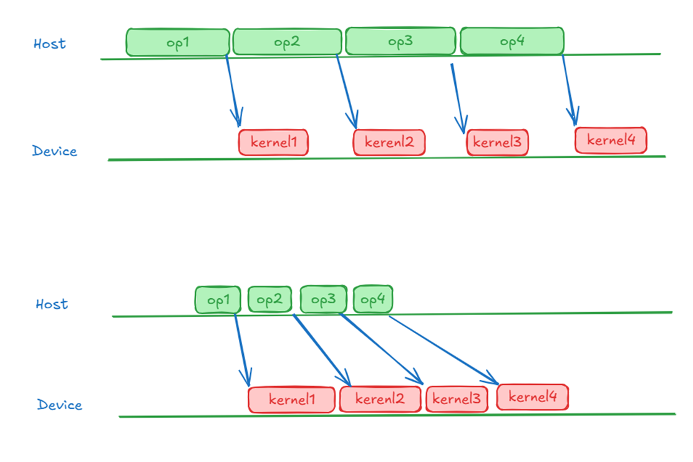

### 两种类型的性能瓶颈
由于Host准备算子上下文并下发算子也是需要时间，因此这种工作模式下存在两种可能的性能瓶颈：

- Host Bound：Host下发较慢， 设备侧（NPU）执行算子较快， Host执行效率成为整体性能瓶颈。在profiling图上， 表现为Stream上的Kernel间存在空泡。 此时设备侧的算力没有得到充分利用， 需要优化Host程序，加快算子下发。

- Device Bound： Host下发较快， Device执行较慢， Device执行效率成为性能瓶颈。这种场景下，设备侧算力被充分利用， 如想继续提高性能， 则需要考虑优化kernel.

上图分别给出了这两种性能瓶颈的示例。

### 算子下发过程

单个算子的下发过程可以简化为如下步骤：

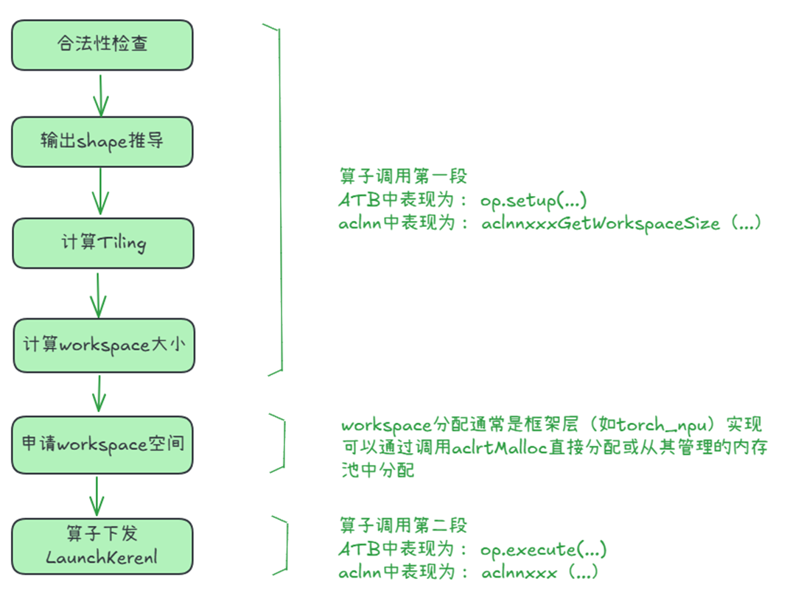


1. 合法性检查 

    检查算子输入、输出、参数是否符合算子要求， 防止错误参数提交到Device后导致错误。

2. 输出shape推导（Infer Shape）：通过算子的输入Shape和Data type推导输出Shape和Data Type。

    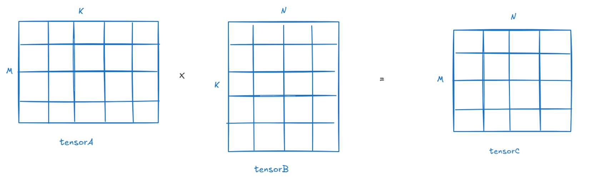

    例如上述一个简单的Matmul算子， 左矩阵Shape为M * K，右矩阵为K * N， 可以推导输出矩阵Shape为M * N。

3. 计算Tiling

    大多数情况下，单个AI Core一次能处理的数据有限，算子的输入数据无法一次完全载入完成计算，需要将输入切分成多块，分块完成计算，这个过程叫Tiling，数据切分的算法称为Tiling算法或者Tiling策略。

    对于复杂算子来说， 每个Kernel实现都可能有自己的Tiling算法： 根据输入输出Tensor的Shape和其他信息计算出进行Kernel执行过程中如何切分。计算的结果一般保存在一个自定义的Tiling数据结构中。

    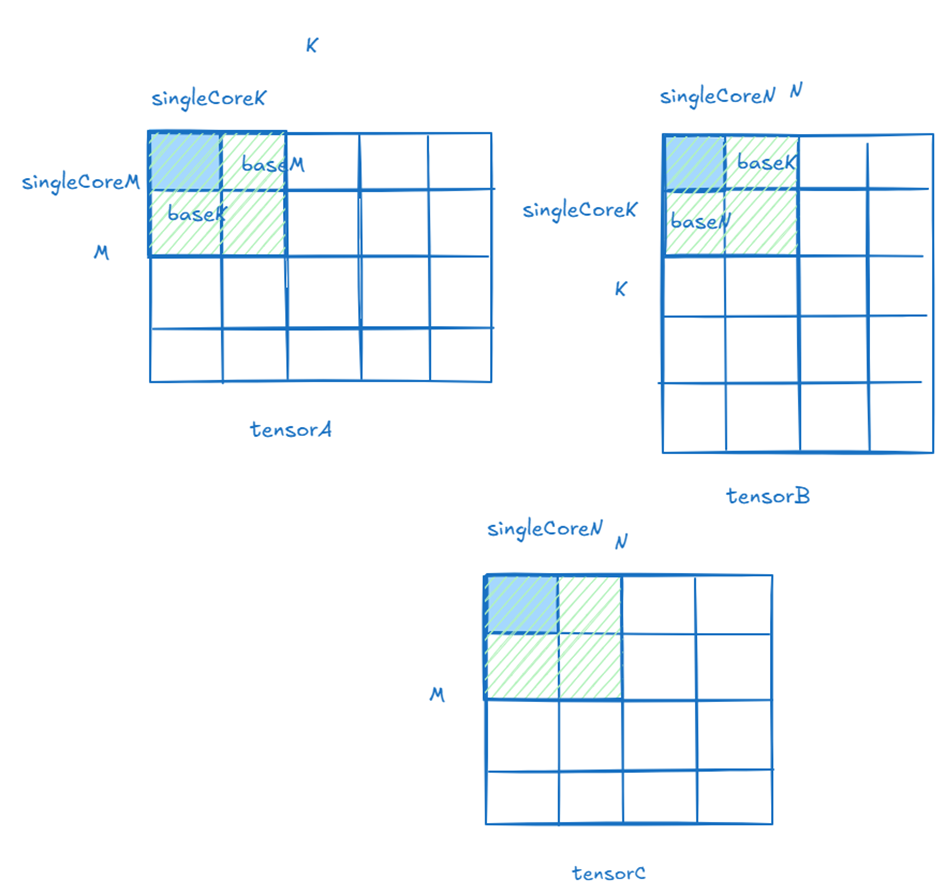

    上图所示是一个矩阵乘Matmul的Tiling策略：

    - 首先要进行多核切分: 根据当前核数，对M、K、N进行多核切分，得到单核内shape大小singleCoreM、singleCoreK、singleCoreN。

    - 接着要进行核内切分: 根据Local Memory的大小约束，对单核内的Shape大小进一步切分，得到A、B、C矩阵参与一次矩阵乘指令的Shape大小baseM、baseN、baseK。

    ATB会把Tiling策略用一个结构体保存起来，后续传给算子核函数使用。在此例中是struct matmulTilingData。

    ```cpp
    struct matmulTilingData {
        uint singleCoreM；
        uint singleCoreK；
        uint singleCoreN；
        uint baseM;
        uint basek；
        uint baseN；
    }
    ```

    Tiling策略对复杂算子的性能影响巨大， 同一个算子在不同Tiling策略下可能有10倍性能差异。


4. 获取Workspace大小

    算子内部有时需要通过额外的HBM内存进行数据交换或者缓存， 这部分空间称为算子的Workspace。 需要在算子实际执行前分配好。 

    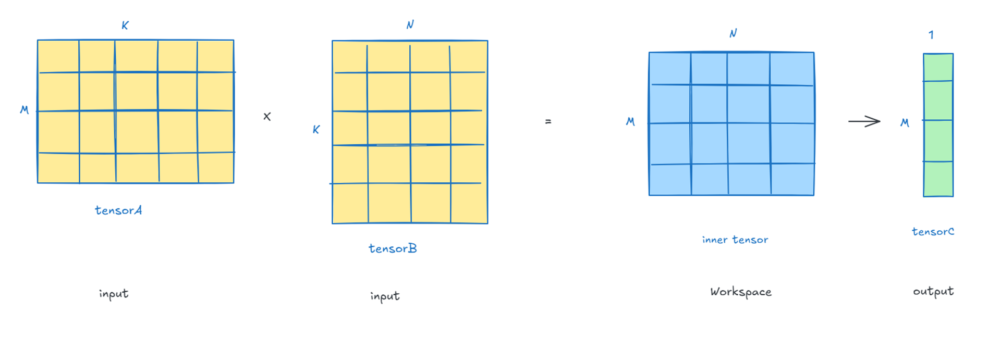

    上面的示例中， 先进行矩阵乘法， 然后进行一次Reduce。 需要使用Workspace暂存矩阵乘结果。

5. 分配Workspace

    对于ATB和aclnn这样的两段式算子接口来说， 这个步骤一般由执行框架（如torch-npu）进行分配， 而不是算子内部实现。 这样外部框架可以管理整个模型执行过程中间的HBM资源， 提高分配效率。

6. 算子下发

    将之前准备好的输入输出Tensor地址、Tiling信息、Workspace地址内存空间，以及其他参数，封装成argument list ，调用Launch Kernel接口，通知Device侧按照上面的参数执行Kernel。

    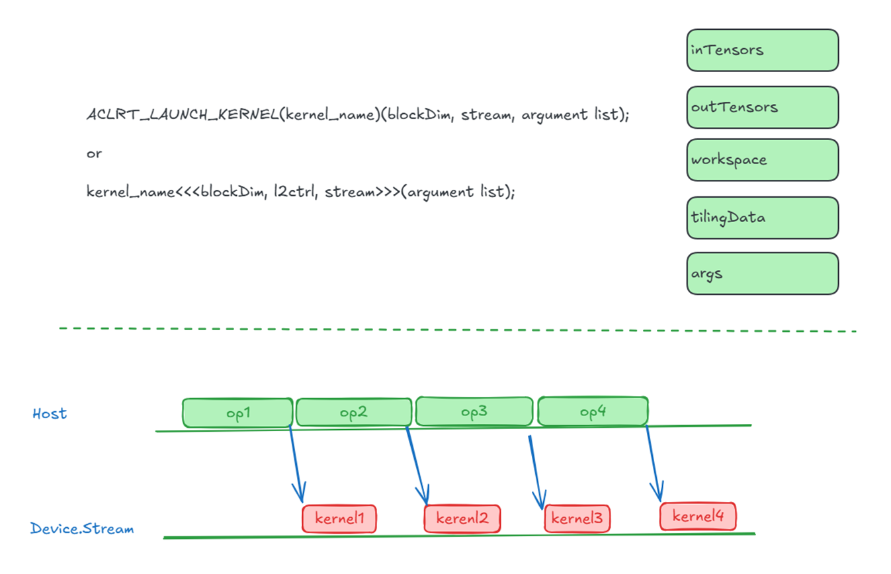

## ATB工作原理

当模型变得越来越复杂， 算子越来越多，前述的Host Bound会逐渐显现。 为了解决这个问题，ATB进行了针对性的优化。它提供如下功能：

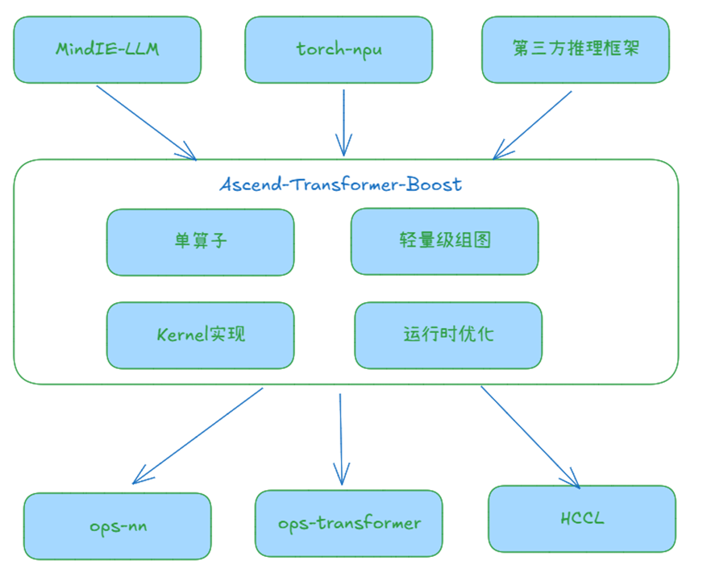

1. 定制化融合算子: 提供Transformer结构常用的算子，如PageAttention、Linear等。ATB提供的算子通常是针对主流模型经过精心设计的融合算子， 具有较高的性能。

2. 轻量级组图: 支持使用上述算子或第三方算子组图，然后像操作单算子一样操作图， 下面称其为图算子。图算子可以很方便地在不同模型、不同layer之间复用。

3. 运行时优化: 采用了多种优化方案， 提升Host性能并降低Device内存占用。 具体总结如下：
    - Tiling Cache机制：通过缓存计算好的Tiling，以存代算，减少重复计算。
    - 调度优化：优化组图模式下算子下发调度方式，使设备侧算子运行无间隙，解决Host Bound。
    - 内存优化：通过基于内存Block分裂、合并、尾块优化的内存分配算法，实现图算子内部中间Tensor复用，平均节省Workspace 50%，提升大模型推理Batch Size上限。

### 组图实例
详见 tests/framework/c++/layer_ops/llama65b/layer/llama65b_layer_mlp_graph_builder.cpp 中CreateLlamaMlpOperationByGraphOpBuilder函数。
下面仅包含组图逻辑主体。

```cpp
atb::Status CreateLlamaMlpOperationByGraphOpBuilder(const LlamaMlpParamGb &param, atb::Operation **operation)
{
    atb::GraphOpBuilder* graphOpBuilder;
    CreateGraphOpBuilder(&graphOpBuilder);
    /* 此处省略了参数创建 */
    graphOpBuilder->Init(
        "LlamaMlpGraphOp",
        inferShapeFunc,
        {"hidden_states", "weight"},
        {"mlp_out"}
    );

    graphOpBuilder->Reshape("hidden_states", reshape_01_2, "hidden_states_");
    graphOpBuilder->AddOperation(Linear(param), {"hidden_states_", "weight"}, {"linear_out"});
    graphOpBuilder->Reshape("linear_out", unsqueueze_0, "linear_out_");
    graphOpBuilder->AddOperation(Split(param), {"linear_out_"}, {"gate_out", "up_out"});
    graphOpBuilder->AddOperation(Swish(param), {"gate_out"}, {"swish_out"});
    graphOpBuilder->AddOperation(Mul(param), {"swish_out", "up_out"}, {"mlp_out"});

    *operation = graphOpBuilder->Build();
    DestroyGraphOpBuilder(graphOpBuilder);
    return atb::NO_ERROR;
}

```

上述代码组建了一个由四个算子组成的图算子。 逻辑视图如下：

 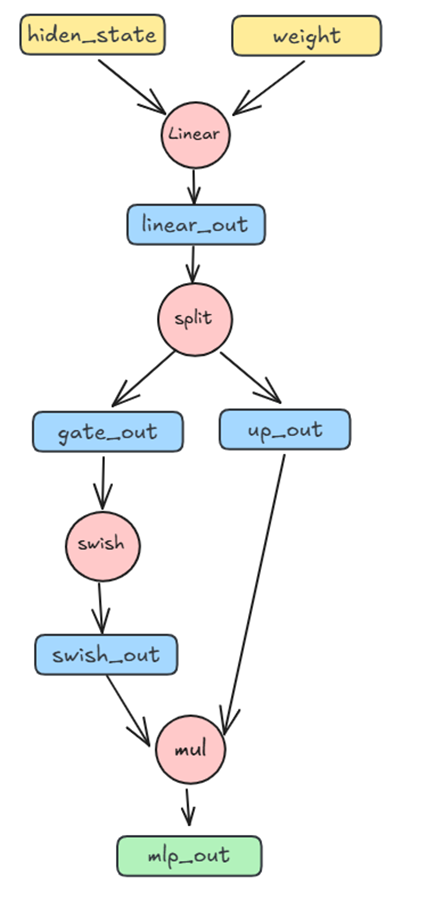

在ATB的内部， 使用两个Vector容器分别存放算子节点和算子的输入输出。

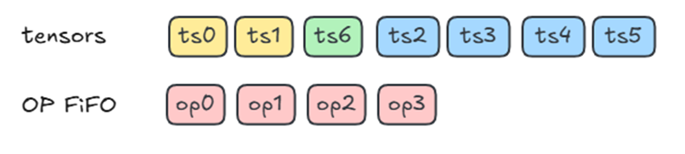

### 图算子Setup和Execute流程

由于ATB中图算子只是单算子的组合，不涉及Kernel融合， 因此图算子的Setup和Execute过程与单算子类似， 区别仅在于Setup阶段进行了Workspace优化。Setup和Execute流程分别如下所示：

 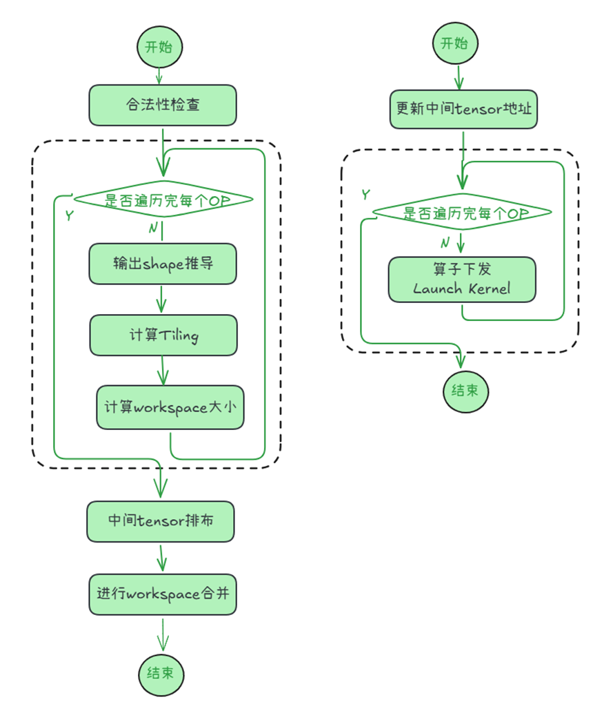

### 运行时优化

1. Setup复用和Cache优化

    实际推理过程中， 即使是动态Shape场景下，多次推理过程的输入Shape也大概率重复。 基于这个特征， 可以进行如下优化：

    - 使用一个Cache保存一个算子常用的多份Tiling信息（默认每个算子保存10份）， Shape相同场景下可以避免重复计算。

    - 每个算子执行上下文中，保存了上一次执行的Tensor信息、Tiling信息、Worksspace Size信息。 如果某次执行的Shape与上次完全相同，则可以直接复用上下文， 跳过整个Setup阶段。

    上述两种优化对图算子和单算子都适用。

    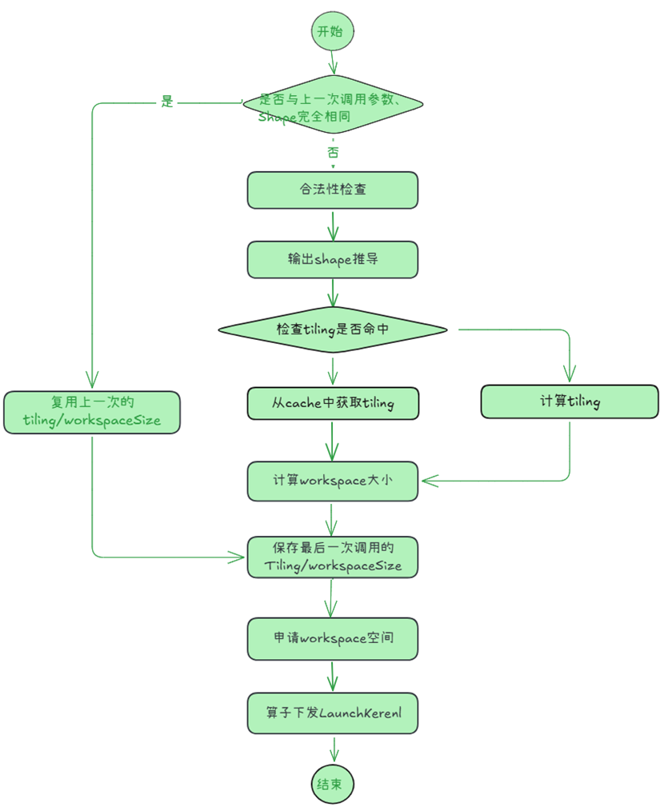

2. HBM内存优化

    ATB在图算子Setup阶段尽可能复用HBM， 使得整个图算子的Workspace size比内部单算子Workspace size的总和要小。具体方式如下：

    - 一个流中的算子Kernel是顺序执行的， 所以前一个算子的Workspace可以给后一个算子使用。 

    - 一个图算子内部的中间Tensor不需要保留到图算子执行完毕， 只要最后一个使用它的单算子执行完毕后，就可以释放空间给其他Tensor使用。

    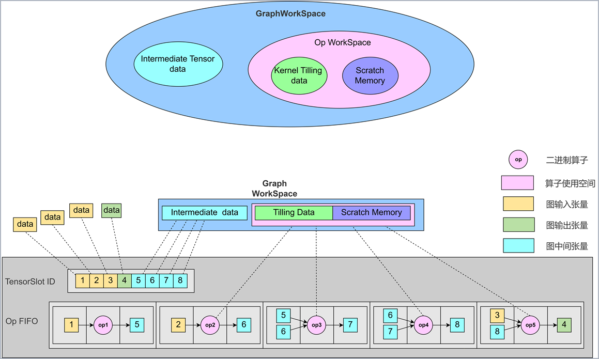


3. 下发优化

    优化前下发调度：逐个算子执行Setup和execution，容易在NPU上形成空泡

    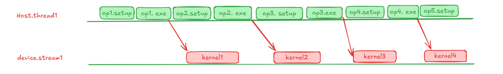


    基础优化：ATB通过图算子批量进行算子Setup和任务下发，可有效减少NPU空泡。 这一步优化是组图模式自动实现的。不需要用户特殊操作。

    

    双线程下发优化（推荐使用）：通过双线程分别进行算子批量Setup和批量任务下发，可以同时减少host执行时间和NPU空泡。
    这种当时需要用户创建两个线程， 其中一个线程处理Setup， 另一个线程处理Execute。
    

    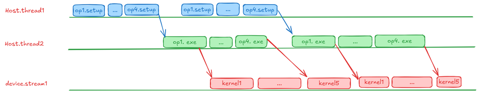
