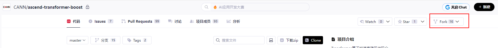
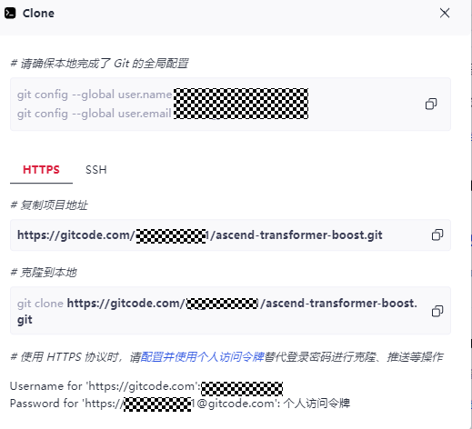
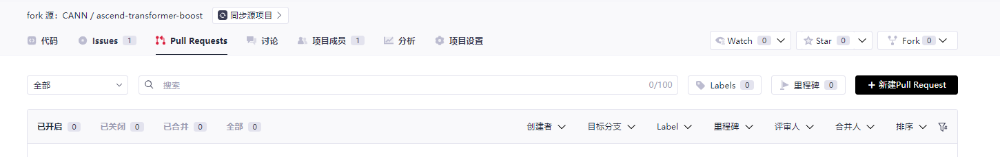
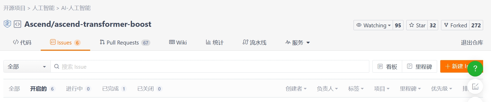
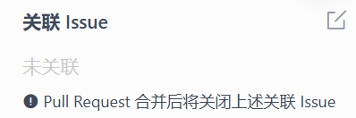
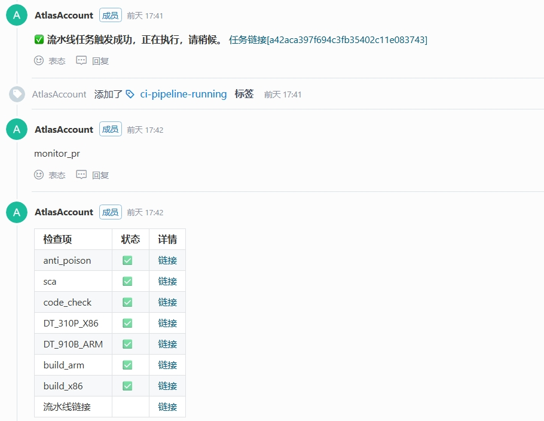
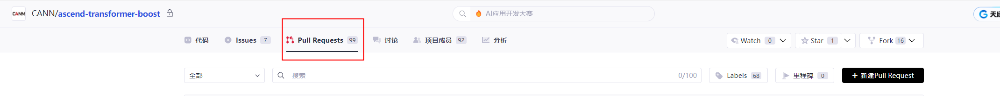

# GitCode Workflow

### 1. Preparations

- Ensure that Git has been installed. You can search for more information about Git on Google, Baidu, or other search engines.
- Before starting the GitCode workflow, you need to find the [ATB](https://gitcode.com/cann/ascend-transformer-boost) repository on the CANN code hosting platform.

### 2. Preparing Local Code

#### 2.1 Forking to Personal Branch

1) Visit the homepage of the project.
2) Click the `Fork` button in the upper right corner and follow the instructions to create a **Personal** fork branch on the cloud.

  

#### 2.2 Cloning the Forked Branch

Perform the following steps to download the code in the repository.

1) Create a local working directory.

Create a local working directory for local code search and management.

```
mkdir ${your_working_dir}
```

2. Configure the global username and email for Git. (Skip this step if you have completed the configuration.)

Set the Git user name to your GitCode ID.

```
git config --global user.name "Your GitCode name"
```

Configure the Git email.

```
git config --global user.email "email@your_email.com"
```

3) Register an SSH public key. (If you do not complete the registration, your account and password will be required each time.)

- Generate an SSH public key.

  ```sh
  ssh-keygen -t rsa -C "your_email@example.com"
  cat ~/.ssh/id_rsa.pub
  ```

- Log in to your GitCode account and add your SSH public key.

  On the GitCode page, click your avatar in the upper right corner and choose **Settings** below your avatar. Under **Security Settings**, click **SSH Keys**. In the **Add Key** area, add the SSH public key obtained by running the `cat` command.

  

  Authenticate your local SSH client with GitCode.

  ```
  ssh -T git@gitcode.com
  ```

  If you see the following success message, your SSH public key is active:
  `Hi $user_name! You've successfully authenticated, but GITCODE.COM does not provide shell access.`

4) Clone the remote repository.

- Switch to your local working directory.

  ```
  cd $your_working_dir
  ```

- Clone the remote repository.

  - On the homepage of the remote repository you want to download, click `Clone/Download` to obtain `$remote_link`. (You need to create a token and enter it instead of a password for login.)

    

  - Run the following commands on your local computer:

    ```
    # Download the remote repository.
    git clone https://gitcode.com/$user_name/ascend-transformer-boost.git
    # Set the upstream source of the local working directory to the original repository.
    git remote add upstream https://gitcode.com/cann/ascend-transformer-boost.git
    ```

#### 2.3 Pulling a Branch

Update your local branch.

```
git fetch upstream
git checkout master
git rebase upstream/master
```

Create a local personal branch.

```
git checkout -b myfeature
```

 `myfeature` is the name of the personal branch. You will edit and modify code on this branch.

### 3. Completing Local Build and Validation

For details about local build and validation, see [Build and Test](../development_guide.md#build).

### 4. Syncing Branch with Master

```
# While on your myfeature branch
git fetch upstream
git rebase upstream/master
```

When merging branches, do not use `git pull` to replace the `fetch` and `rebase` commands above. This is because it makes the commit history confusing and code difficult to understand. You can change `git pull` behavior by modifying the `.git/config` file or using the `git config branch.autoSetupRebase always` command to make it use `rebase` by default.

### 5. Committing Changes in the Local Working Directory

Commit your changes.

```
git add .
git commit -m "Commit description"
```

You may continue editing, building, and testing more based on previous commits. Use `git commit --amend` to add those new changes.

### 6. Pushing Changes to Your Remote Repository

When your changes are ready for review (or you want to create a remote backup of your work), push the branch to your forked repository on GitCode.

```
git push -f origin myfeature
```

### 7. Creating a Pull Request on GitCode

1. Visit `https://gitcode.com/$user/ascend-transformer-boost` and click `+Pull Request`.
<!--
   
-->
2. On the page for creating a new pull request, confirm the source and target branches, and create a PR.

   Submitting a PR merges changes into the project's master branch. To ensure merge quality, please proceed with caution.

### 8. Associating the PR with the Issue It Addresses

1. Access the issue list of the repository and go to the page of the issue addressed by your pull request.
<!--
   
-->
2. In the `Pull Requests` section on the right of the `Issues` page, select the PR you submitted to associate it. Once associated, that issue will be automatically closed when the PR is merged.
<!--
   
-->
### 9. Checking CI Status and Code Review Comments

- Check the CI status.

  After submitting a PR, enter `/compile` to trigger a CI check. The check duration varies by repository. Monitor the check status and promptly address any issues.

  If the message indicating that the CI task has been executed is displayed and the label in the upper right corner shows `ci-pipeline-passed`, the CI check has passed.
<!--
  
-->
  If any CI task fails, click `Jump` under the corresponding `Log Details` to view the failure reason in the log and adjust your code accordingly.

- Check code review comments.

   After the CI check passes and you submit the PR, the PR is assigned to one or more reviewers. These reviewers will conduct a thorough code review to ensure correctness, covering not only code but also comments and documentation.

   You can find your PR in the PR list and view the review comments on the PR.
<!--
   
-->
### Common Operations

#### Reverting a Commit

To revert a commit, following the steps below.

If you have write access to the upstream repository, do not click the `Revert` button on the GitCode UI to create a PR, as GitCode creates a branch of your PR in the main repository rather than in your fork.

- Create a branch and sync it with the upstream repository.

  ```
  # Create a branch.
  git checkout -b myrevert

  # Sync the branch with upstream.
  git fetch upstream
  git rebase upstream/master
  ```

- Run either of the following commands according to the type of the commit you want to revert.

  - **merge commit:**

    ```
    # SHA is the hash of the merge commit you wish to revert
    git revert -m 1 SHA
    ```

  - **single commit:**

    ```
    # SHA is the hash of the single commit you wish to revert
    git revert SHA
    ```

- A new commit is created to revert the previous commit. Then, run the `push` command to push the commit to your remote repository.

```
git push ${your_remote_name} myrevert
```

- Create a PR based on the created branch.

#### Handling PR Conflicts

The following mark indicates that the your PR conflicts with the main repository. You need to handle the conflict.
<!--

-->
1. Switch to the master branch and rebase it.

   ```
   git checkout master
   git fetch upstream
   git rebase upstream/master
   ```

2. Switch to the branch you are using and start rebasing.

   ```
   git checkout yourbranch
   git rebase master
   ```

3. The conflict message is displayed in the Git output. You can use tools such as `vi` to view the conflict.

4. After the conflict is resolved, commit the changes.

   ```
   git add .
   git rebase --continue
   git push -f origin yourbranch
   ```

#### Squashing Commits

Multiple commits in a PR can cause inconvenience to reviewers. After you modified the code in a PR based on the PR review comments, you can squash the commits.

1. View logs of the local branch.

   ```
   git log
   ```

2. Squash the latest *n* commits into one.

   ```
   git rebase -i HEAD~n
   ```

   Change `pick` to `s` for the commits you want to squash. You must `pick` at least one commit. Otherwise, there will be no target for squashing, causing an error.

3. After making the changes, press `ESC`, then type `:wq`. An interface will pop up asking if you want to edit the commit message. Type `e` to enter the message editing page. Delete or edit the commit messages as required. Then, press `Esc` and enter `:wq` to save and exit.

4. Push the commit.

   ```
   git push -f origin yourbranch
   ```

5. Go back to the PR page on GitCode. You will see that the previous commits have been squashed.
