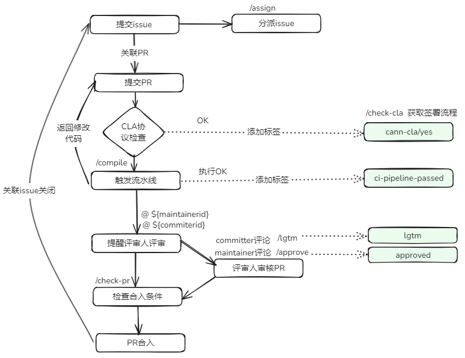

****

## 🚀 Interaction in the CANN Community

All projects in the CANN community are maintained by the Bot. This means that developers can trigger Bot commands through comments under each pull request (PR) or issue. Here's how you interact with the Bot:
<!--

-->
## 🎯 For details about the commands, see the table below.

<table class="command">
    <thead>
        <tr>
            <th width="15%">Command</th>
            <th width="15%">Example</th>
            <th width="10%">Used In</th>
            <th width="30%">Description</th>
            <th width="15%">Target Audience</th>
            <th width="15%">Repository</th>
        </tr>
    </thead>
    <tbody>
        <tr>
            <td>
                /check-cla
            </td>
            <td style="white-space:nowrap;">
                /check-cla
            </td>
            <td>
                <strong>PR</strong>
            </td>
            <td>
                Forcibly rechecks the CLA status of a pull request.
                If the pull request author has signed the CLA, the <strong>cann-cla/yes</strong> label will be added to the pull request. If not, the <strong>cann-cla/no</strong> label will be added.
            </td>
            <td>
                All developers
            </td>
            <td>
                All repositories
            </td>
        </tr>
        <tr>
            <td>
                /cla cancel
            </td>
            <td style="white-space:nowrap;">
                /cla cancel
            </td>
            <td>
                <strong>PR</strong>
            </td>
            <td>
                Forcibly deletes the <strong>cann-cla/yes</strong> tag.
            </td>
            <td>
               Repository administrator
            </td>
            <td>
                All repositories
            </td>
        </tr>
        <tr>
           <td>
                /compile
           </td>
           <td style="white-space:nowrap;">
                /compile
           </td>
           <td>
                <strong>PR</strong>
            </td>
           <td>
                Triggers a CodeArts pipeline build.
                After successful build, the pull request will be labeled with <strong>ci-pipeline-passed</strong>. If the build fails, the pull request will be labeled with <strong>ci-pipeline-failed</strong>.
           </td>
           <td>
              All developers
           </td>
           <td>
              All repositories
           </td>
        </tr>
        <tr>
            <td>
                /lgtm
            </td>
            <td style="white-space:nowrap;">
                /lgtm
            </td>
            <td>
                <strong>PR</strong>
            </td>
            <td>
                Adds the <strong>lgtm</strong> label to indicate that the code has been reviewed.
            </td>
            <td>
              Reviewers of the SIG group to which the repository belongs
            </td>
            <td>
                All repositories
            </td>
        </tr>
        <tr>
            <td>
                /lgtm cancel
            </td>
            <td style="white-space:nowrap;">
                /lgtm cancel
            </td>
            <td>
                <strong>PR</strong>
            </td>
            <td>
                Removes the <strong>lgtm</strong> label that indicates the code has been reviewed.
            </td>
            <td>
              Reviewers of the SIG group to which the repository belongs
            </td>
            <td>
                All repositories
            </td>
        </tr>
        <tr>
            <td>
                /approve
            </td>
            <td style="white-space:nowrap;">
                /approve
            </td>
            <td>
                <strong>PR</strong>
            </td>
            <td>
                Adds the <strong>lgtm</strong> label to indicate that the committers approve the PR.
            </td>
            <td>
              Committers of the SIG group to which the repository belongs
            </td>
            <td>
                All repositories
            </td>
        </tr>
        <tr>
            <td>
                /approve cancel
            </td>
            <td style="white-space:nowrap;">
                /approve cancel
            </td>
            <td>
                <strong>PR</strong>
            </td>
            <td>
                Removes the <strong>approved</strong> label that indicates the committers approve the PR.
            </td>
            <td>
              Committers of the SIG group to which the repository belongs
            </td>
            <td>
                All repositories
            </td>
        </tr>
        <tr>
            <td>
                /check-pr
            </td>
            <td style="white-space:nowrap;">
                /check-pr
            </td>
            <td>
                <strong>PR</strong>
            </td>
            <td>
                Checks whether the labels in a pull request meet the conditions. If yes, the pull request is merged.
            </td>
            <td>
                Anyone can trigger this command on a pull request.
            </td>
            <td>
                All repositories
            </td>
        </tr>
        <tr>
            <td>
                /merge
            </td>
            <td style="white-space:nowrap;">
                /merge
            </td>
            <td>
                <strong>PR</strong>
            </td>
            <td>
                Adds the <strong>keeper_approved</strong> label to indicate that the branch keeper approves the merge.
            </td>
            <td>
                Branch keeper
            </td>
            <td>
                All repositories
            </td>
        </tr>
        <tr>
            <td>
                /kind **
            </td>
            <td style="white-space:nowrap;">
                /kind bug,
                 Letters, digits, hyphens (-), and underscores (_) are allowed for **.
                 This setting applies to the ** in the following commands.
            </td>
            <td>
                <strong>PR</strong>
                 <strong>Issue</strong>
            </td>
            <td>
                Adds the <strong>kind/bug</strong> label.
            </td>
            <td>
                Repository administrators can directly add labels. Others can add labels by commenting, for example, via `kind/AI`, but the label must already exist in the repository. Otherwise, the label cannot be added.
            </td>
            <td>
                All repositories
            </td>
        </tr>
        <tr>
            <td>
                /remove-kind **
            </td>
            <td style="white-space:nowrap;">
                /remove-kind bug
            </td>
            <td>
                <strong>PR</strong>
                 <strong>Issue</strong>
            </td>
            <td>
                Removes the <strong>kind/bug</strong> label.
            </td>
            <td>
                Everyone
            </td>
            <td>
                All repositories
            </td>
        </tr>
        <tr>
            <td>
                /priority **
            </td>
            <td style="white-space:nowrap;">
                /priority high
            </td>
            <td>
                <strong>PR</strong>
                 <strong>Issue</strong>
            </td>
            <td>
                Adds the <strong>priority/high</strong> label.
            </td>
            <td>
                Repository administrators can directly add labels. Others can add labels by commenting, for example, via `kind/AI`, but the label must already exist in the repository. Otherwise, the label cannot be added.
            </td>
            <td>
                All repositories
            </td>
        </tr>
        <tr>
            <td>
                /remove-priority **
            </td>
            <td style="white-space:nowrap;">
                /remove-priority high
            </td>
            <td>
                <strong>PR</strong>
                 <strong>Issue</strong>
            </td>
            <td>
                Remove the <strong>priority/high</strong> label.
            </td>
            <td>
                Everyone
            </td>
            <td>
                All repositories
            </td>
        </tr>
        <tr>
            <td>
                /sig **
            </td>
            <td style="white-space:nowrap;">
                /sig AI
            </td>
            <td>
                <strong>PR</strong>
                 <strong>Issue</strong>
            </td>
            <td>
                Adds the <strong>sig/AI</strong> label.
            </td>
            <td>
                Repository administrators can directly add labels. Others can add labels by commenting, for example, via `kind/AI`, but the label must already exist in the repository. Otherwise, the label cannot be added.
            </td>
            <td>
                All repositories
            </td>
        </tr>
        <tr>
            <td>
                /remove-sig **
            </td>
            <td style="white-space:nowrap;">
                /remove-sig AI
            </td>
            <td>
                <strong>PR</strong>
                 <strong>Issue</strong>
            </td>
            <td>
                Removes the <strong>sig/AI</strong> label.
            </td>
            <td>
                Everyone
            </td>
            <td>
                All repositories
            </td>
        </tr>
        <tr>
            <td>
                /assign [[@]...]
            </td>
            <td style="white-space:nowrap;">
                /assign
                 /assign @cann-robot
            </td>
            <td>
                 <strong>Issue</strong>
            </td>
            <td>
                Assigns an owner for an issue.
            </td>
            <td>
                Everyone
            </td>
            <td>
                All repositories
            </td>
        </tr>
        <tr>
            <td>
                /unassign [[@]...]
            </td>
            <td style="white-space:nowrap;">
                /unassign
                 /unassign @cann-robot
            </td>
            <td>
                 <strong>Issue</strong>
            </td>
            <td>
                Unassigns an owner for an issue.
            </td>
            <td>
                Everyone
            </td>
            <td>
                All repositories
            </td>
        </tr>
    </tbody>
</table>
