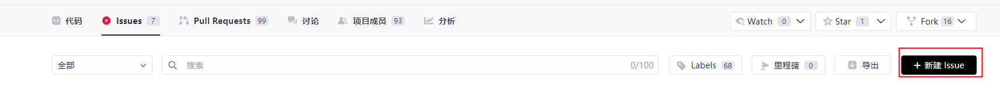
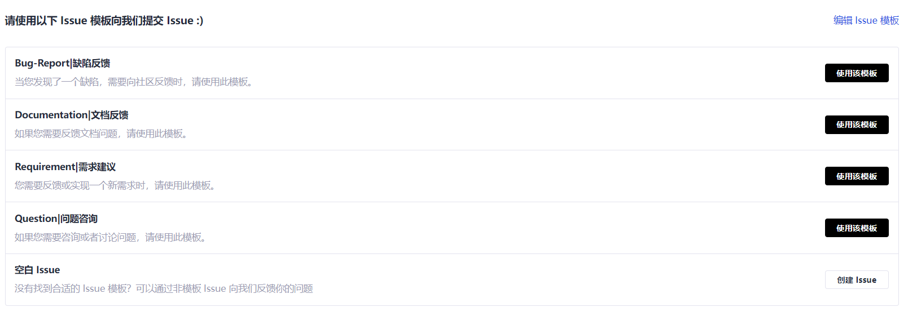
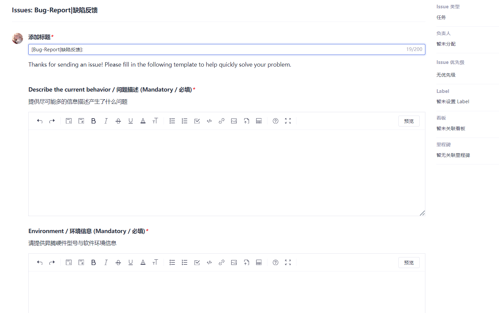

# Issue Submission Guide

CANN projects use GitCode's issue system to track and manage each user issue.

The following describes basic operations on issues.

1. Create an issue.

   Each GitCode repository has an issue section. Click the button to create an issue on the repository page and select an issue type.
   a. Click the button to create an issue.
   <!--
     
   -->
   b. Select an issue type as needed and proceed.
   <!--
     
  -->
2. Specify issue details.

   On the issue creation page, enter the issue details.
   <!--
   
   -->
   a. Enter the issue title.

      Briefly describe the requirement or key points of the issue in the title bar.

   b. Enter the issue details.

      After you select a type, the system automatically provides a template. To help us resolve your requirements or issues, please fill in the template in detail.

3. Submit the issue.

   After specifying the issue details, click the button to create the issue.
   Other information such as the issue owner requires no specifying. The repository handler will periodically review the issues and assign them based on the issue types.
