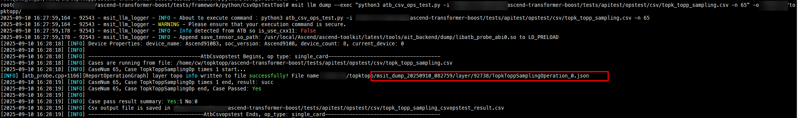
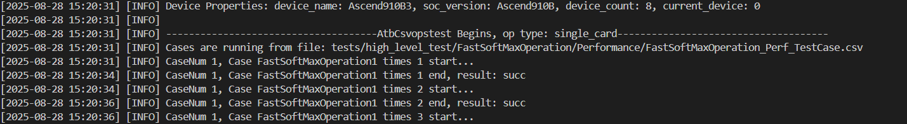

# ATB Operator Development Guide

## Overview

### Differences from Non-ATB Operator Development

* Ascend C is a programming language launched by CANN for operator development. Using Ascend C, developers can develop operators themselves and innovate algorithms with efficiency.
* Operator implementation includes two parts: tiling and kernel development.
* ATB operator development, on the other hand, focuses on implementing new operators based on the existing operator library, avoiding duplicate work. However, it requires integrating the operators into the ATB and writing the external interfaces for the ATB operators.

### ATB Operator Development Process
<!--

-->
(1) Environment Setup

- For CANN software installation, check [this guide](https://www.hiascend.com/document/detail/en/CANNCommunityEdition/850alpha001/opdevg/Ascendcopdevg/atlas_ascendc_10_0002.html) (you can switch to the latest version in the top-left corner; the same applies below).

(2) Operator Implementation

- Kernel-side operator implementation and host-side tiling implementation are largely the same as non-ATB operator development (refer to [this guide](https://www.hiascend.com/document/detail/en/CANNCommunityEdition/850alpha001/opdevg/Ascendcopdevg/atlas_ascendc_10_0030.html)). This document mainly highlights the differences.

(3) ATB Integration

- Tiling and kernel development equip the ATB with the operator's processing and computation capabilities. However, to support single-operator calls and operator graphs through the ATB operators, additional operation/runner development is required. This step is not involved in standalone Ascend C operator development.

(4) Build and Test

- Build: Use scripts for compilation and build.
- Test case writing: Write test cases to call operators and measure the error between the developed operators and the benchmark operators.
Note: If you encounter any issues during the build and test process, refer to [ATB Logs and Debugging](./logging_and_debugging.md) for troubleshooting.

## ATB Operator Development

### Deliverables

Adding a new ATB operator brings changes to the file structure and content in two aspects:

* Operator implementation: tiling and kernel development
* ATB framework integration: file modifications to provide single-operator calls and operator graphs through ATB interfaces when developing the operator OP.

Note: The following sections will use adding a new fused operator `fastsoftmax` as an example to describe what needs to be added and modified in the ATB repository.

#### Operator Implementation Deliverables

##### Description of New Files

* Add the `src/kernels/include/atbops/params/fastsoftmax.h` file to define the parameter structure of the `FastSoftMax` operation.

  ```c++
  #ifndef ATBOPS_PARAMS_FASTSOFTMAX_H
   #define ATBOPS_PARAMS_FASTSOFTMAX_H

   #include <cstdint>
   #include <string>
   #include <sstream>
   #include <mki/utils/SVector/SVector.h>

   namespace AtbOps {
   namespace OpParam {
   struct FastSoftMax {
       std::vector<int32_t> qSeqLen;
       int32_t headNum = 0;

       bool operator==(const FastSoftMax &other) const
       {
           return this->qSeqLen == other.qSeqLen && this->headNum == other.headNum;
       }
   };

   } // namespace OpParam
   } // namespace AtbOps

   #endif // ATBOPS_PARAMS_FASTSOFTMAX_H

  ```

* Add the `fastsoftmax` directory to `src/kernels/mixkernels`. The specific file contents are described later. The directory structure is as follows:

  ```
    fastsoftmax
    ├── op_kernel                                // Kernel-side implementation files (including the kernel function entry and implementation files)
    │   └── fast_softmax.cpp
    ├── tiling                                    // New operator tiling
    │   ├── fastsoftmax_tiling.cpp	// Core tiling algorithm
    │   ├── fastsoftmax_tiling.h	// Operator tiling interface
    │   └── tiling_data.h			// Definition of the tiling_data structure for passing between tiling and the kernel
    ├── CMakeLists.txt	                    // CMake file for building the new operator
    ├── fastsoftmax_kernel.cpp           // Verification
    └── fastsoftmax_operation.cpp     // Shape validation
  ```

* Add the `tests/apitest/kernelstest/mix/test_fastsoftmax.py` file for precision testing.
* Add the `tests/apitest/opstest/csv/fast_soft_max.csv` file to provide operator input test samples.

##### Description of Modified Files

* Add the new header file to `src/kernels/include/atbops/params/params.h`.

  ```c++
    #include "atbops/params/fastsoftmax.h"
  ```

* Add the `FastSoftMaxOperation` class to `tests/framework/python/CsvOpsTestTool/data_generation.py`, including methods such as golden function definition and error comparison.
* Add the following content to `src/kernels/configs/mixkernels/op_list.yaml` (this file does not exist on first build. The added content is very important as it adds the new operator information to the list. Only then will the implementation and interfaces of the new operator truly complete in subsequent builds. If the added operator is not a fused operator, modify `src/kernels/configs/kernels/op_list.yaml` instead):

  ```
  FastSoftMaxOperation:
    FastSoftMaxKernel:
        ascend910b: true
  ```

#### ATB Integration Deliverables

##### Description of New Files

- Add a directory named after the operator in the `src/ops/ops_infer` or `src/ops/ops_train` directory based on whether the operator is used for inference or training. For the `fastsoftmax` operation, add the `fast_soft_max` directory to `src/ops/ops_train`. The specific file contents are described later. The directory structure is as follows:

  ```
    fast_soft_max
    ├── fastsoftmax_operation.cpp     // ATB interface implementation
    ├── fastsoftmax_operation.h
    ├── fastsoftmax_ops_runner.cpp   // Operator graph
    └── fastsoftmax_ops_runner.h
  ```

- Add the `tests/apitest/opstest/python/operations/fast_soft_max` folder for accuracy testing. For details, see the ATB repository.

  ```
  fast_soft_max
  ├── __init__.py
  └── test_fastsoftmax_operation.py
  ```

##### Description of Modified Files

* Add functionality in `tests/framework/c++/atb_torch/operation/operation_funcs.cpp` to deserialize the FastSoftMax parameters described in JSON into a C++ structure, and then use it to create or update the operator.

  ```c++
   static atb::train::FastSoftMaxParam GetFastSoftMaxParamFromJson(const nlohmann::json &paramJson)
   {
       atb::train::FastSoftMaxParam param;
       if (paramJson.contains("headNum")) {
           param.headNum = paramJson["headNum"].get<int32_t>();
       }
       if (paramJson.contains("qSeqLen")) {
           for (auto item : paramJson["qSeqLen"]) {
               param.qSeqLen.push_back(item.get<int32_t>());
           }
       }
       if (paramJson.contains("rsv")) {
           for (size_t i = 0; i < paramJson["rsv"].size(); i++) {
               param.rsv[i] = paramJson["rsv"].at(i).get<int8_t>();
           }
       }
       return param;
   }

   static atb::Status FastSoftMaxOperationCreate(const nlohmann::json &paramJson, atb::Operation **op)
   {
       return CreateOperation(GetFastSoftMaxParamFromJson(paramJson), op);
   }

   static atb::Status FastSoftMaxOperationUpdate(const nlohmann::json &paramJson, atb::Operation *op)
   {
       return UpdateOperationParam(op, GetFastSoftMaxParamFromJson(paramJson));
   }

  ```

  Add the corresponding key-value pair to `g_funcMap` in the file.

  ```c++
  {"FastSoftMaxOperation", &FastSoftMaxOperationCreate},
  ```

  Add the corresponding key-value pair to `g_update_funcMap` in the file.

  ```
  {"FastSoftMaxOperation", &FastSoftMaxOperationUpdate},
  ```

* Add the following to `include/atb/train_op_params.h`:

  ```C++
    //!
    //! \struct FastSoftMaxParam
    //!
    //! \brief Performs Softmax on the result of multiplying the unpad-processed matrix Q and matrix K. Currently, only Atlas A2/A3 inference and training products are supported.
    //!
    //! \warning The length of the seqLen array cannot exceed 32, and each element must be greater than 0.
    //!
   struct FastSoftMaxParam {
       //! \brief Number of Attention heads.
       int32_t headNum = 0;
       //! \brief Actual input length of each batch. The number of elements is batchSize, and the maximum value is 32.
       std::vector<int32_t> qSeqLen;
       //!
       //! \brief Reserved parameters.
       //!
       uint8_t rsv[8] = {0};
   };

   //!
   //! \brief Checks whether parameters are identical.
   //!
   //! \param left
   //! \param right
   //!
   //! \return A bool value.
   //!
   inline bool operator==(const FastSoftMaxParam &left, const FastSoftMaxParam &right)
   {
       return left.headNum == right.headNum && left.qSeqLen == right.qSeqLen;
   }

  ```

- Add the following content to `src/atb/utils/param_to_json.cpp`:

  ```c++
    template <> nlohmann::json OpParamToJson(const train::FastSoftMaxParam &opParam)
    {
        nlohmann::json paramsJson;
        paramsJson["headNum"] = opParam.headNum;
        paramsJson["qSeqLen"] = opParam.qSeqLen;

        return paramsJson;
    }
  ```

- Add the following content to `src/kernels/mixkernels/param_to_json.cpp`:

  ```c++
  std::string FastSoftMaxToJson(const Any &param)
  {
    nlohmann::json paramsJson;
    OpParam::FastSoftMax specificParam = AnyCast<OpParam::FastSoftMax>(param);

    paramsJson["qSeqLen"] = specificParam.qSeqLen;
    paramsJson["headNum"] = specificParam.headNum;

    return paramsJson.dump();
  }
  ```

  And add `REG_STRINGIFY (OpParam::FastSoftMax, FastSoftMaxToJson);`

- Add the operator description to `ops_configs/atb_ops_info.ini`.

  ```
  [FastSoftMaxOperation]
  input0.name=x
  input0.dtype=float16
  input0.format=nd
  output0.name=output
  output0.dtype=float16
  output0.format=nd
  ```

### Tiling

For core concepts in operator development, such as `TilingData`, `Workspace`, `TilingKey`, and `BlockDim`, refer to the [glossary](https://www.hiascend.com/document/detail/en/CANNCommunityEdition/850alpha001/opdevg/Ascendcopdevg/atlas_ascendc_10_00013.html).

#### Code Implementation

The files related to tiling are `tiling_data.h`, `fastsoftmax_tiling.h`, and `fastsoftmax_tiling.cpp`.

Note: The major difference between ATB operator development and [Ascend C operator development](https://www.hiascend.com/document/detail/en/CANNCommunityEdition/850alpha001/opdevg/Ascendcopdevg/atlas_ascendc_10_0001.html) lies in the definition and use of the `TilingData` structure. Ascend C uses `BEGIN_TILING_DATA_DEF` to register the structure, while ATB operator development requires users to directly define it. The functionality of the code is the same; you only need to pay attention to the structure code writing.

##### tiling_data.h

File path: `src/kernels/mixkernels/fastsoftmax/tiling/tiling_data.h`

You can view the complete content in the code repository based on the file path. The `tiling_data.h` header file contains two parts:

- Constant definitions: Fix the key parameters that are frequently used in the operator implementation.
- Data structure definitions: Describes the structure of the operator's input and output data. There are two structure definitions: one for describing the basic information of the input data, and another for describing specific data tiling and processing details, facilitating data processing and passing in the operator implementation.

##### fastsoftmax_tiling.h

File path: `src/kernels/mixkernels/fastsoftmax/tiling/fastsoftmax_tiling.h`
This process tiles data. Therefore, the main function is the one that implements the tiling functionality. Here is the function declaration.

```C++
#ifndef ASCEND_OPS_FASTSOFTMAX_TILING_H
#define ASCEND_OPS_FASTSOFTMAX_TILING_H

#include <mki/launch_param.h>
#include <mki/utils/status/status.h>
#include <mki/kernel_info.h>

namespace AtbOps {
using namespace Mki;
Status FastSoftMaxTiling(const LaunchParam &launchParam, KernelInfo &kernelInfo);

}  // namespace AtbOps

#endif  // ASCEND_OPS_FASTSOFTMAX_TILING_H
```

##### fastsoftmax_tiling.cpp

File path: `src/kernels/mixkernels/fastsoftmax/tiling/fastsoftmax_tiling.cpp`
The main function and its description are as follows:

```C++
Status FastSoftMaxTiling(const LaunchParam &launchParam, KernelInfo &kernelInfo)
{
    // Obtain the platform information: number of physical cores and buffer size.
    uint32_t coreNum = PlatformInfo::Instance().GetCoreNum(CoreType::CORE_TYPE_VECTOR);
    uint32_t ubSize = PlatformInfo::Instance().GetUbSize();
    // Obtain operator parameters.
    auto param = AnyCast<OpParam::FastSoftMax>(launchParam.GetParam());
    uint32_t batchSize = param.qSeqLen.size();
    uint32_t headNum = static_cast<uint32_t>(param.headNum);
    MKI_CHECK(headNum > 0, "head Num is invalid", return Status::FailStatus(ERROR_INVALID_VALUE));

    // Initialize tiling data.
    uint8_t *tiling = kernelInfo.GetTilingHostAddr();
    auto tilingDataPointer = reinterpret_cast<FastSoftMaxTilingData *>(tiling);
    tiling += sizeof(FastSoftMaxTilingData);
    MKI_CHECK(tilingDataPointer != nullptr, "tilingData should not be empty",
        return Status::FailStatus(ERROR_INVALID_VALUE));
    tilingDataPointer->batchSize = batchSize;
    tilingDataPointer->headNum = headNum;

    // Process each tile and set information such as the length and offset.
    uint32_t dataOffset = 0;
    for (uint32_t sampleIndex = 0; sampleIndex < batchSize; ++sampleIndex) {
        uint32_t sampleSeqLenOrigin = static_cast<uint32_t>(param.qSeqLen[sampleIndex]);
        MKI_CHECK(sampleSeqLenOrigin > 0 && sampleSeqLenOrigin <= MAX_SEQ_LEN, "seqlen is invalid",
            return Status::FailStatus(ERROR_INVALID_VALUE));
        auto sampleTilingDataPointer = reinterpret_cast<FastSoftMaxSampleTilingData *>(tiling);
        tiling += sizeof(FastSoftMaxSampleTilingData);
        SetSampleTilingData(sampleTilingDataPointer, ubSize, coreNum, headNum, sampleSeqLenOrigin);
        uint32_t dataLength = headNum * sampleSeqLenOrigin * sampleSeqLenOrigin;
        sampleTilingDataPointer->dataLength = dataLength;
        sampleTilingDataPointer->dataOffset = dataOffset;
        dataOffset += dataLength;
    }
    // Set the block dimension.
    kernelInfo.SetBlockDim(coreNum);
    return Status::OkStatus();
}
```

#### Process Details

<!---->
Tiling policies relate to kernel implementation. Tiling guides the memory allocation and partitioning of the kernel. Information is passed between tiling and the kernel via TilingData.
<!---->

### Kernel Development

For concepts related to the kernel, such as `Compute`, `CopyIn`, and `CopyOut`, refer to the [glossary](https://www.hiascend.com/document/detail/en/CANNCommunityEdition/850alpha001/opdevg/Ascendcopdevg/atlas_ascendc_10_00013.html).

#### Code Implementation

A kernel is the operator execution binary file. Kernel implementation refers to the device-side execution code for the operator, which completes all data movement and computation based on the tiling information.
Note: Due to differences in the definition and use of the `TilingData` structure, there are differences between ATB operator development and [Ascend C operator kernel development](https://www.hiascend.com/document/detail/en/CANNCommunityEdition/850alpha001/opdevg/Ascendcopdevg/atlas_ascendc_10_0063.html).

* In Ascend C operator development, you can call `GET_TILING_DATA(tilingData, tiling);` to obtain `TilingData`. In ATB operator development, use the following method:

    ```C++
    FastSoftMaxTilingData tilingData = GetTilingData(tiling);
    ```

* Before the kernel implementation is started,  `src/kernels/mixkernels/fastsoftmax/fastsoftmax_kernel.cpp` checks the input and output, and performs the kernel-side initialization.

##### fast_softmax.cpp

File path: `src/kernels/mixkernels/fastsoftmax/op_kernel/fast_softmax.cpp`

The major difference compared to Ascend C operator kernel development is the method of obtaining `TilingData`. You can define the GetTilingData function. The differing code is as follows:

```C++
inline __aicore__ FastSoftMaxTilingData GetTilingData(const GM_ADDR tiling)
{
    auto tilingDataPointer = reinterpret_cast<const __gm__ FastSoftMaxTilingData *>(tiling);
    FastSoftMaxTilingData tilingData;
    tilingData.batchSize = tilingDataPointer->batchSize;
    tilingData.headNum = tilingDataPointer->headNum;
    return tilingData;
}
extern "C" __global__ __aicore__ void fastsoftmax(GM_ADDR dataInput, GM_ADDR dataOutput, GM_ADDR tiling)
{
    FastSoftMaxTilingData tilingData = GetTilingData(tiling);
    tiling += sizeof(FastSoftMaxTilingData);
    for (uint32_t sampleIndex = 0; sampleIndex < tilingData.batchSize; ++sampleIndex) {
        FastSoftMaxSampleTilingData sampleTilingData = GetSampleTilingData(tiling);
        FastSoftmax op;
        op.Init(dataInput, dataOutput, sampleTilingData);
        op.Process();
        tiling += sizeof(FastSoftMaxSampleTilingData);
    }
}
```

##### fastsoftmax_kernel.cpp

File path: `src/kernels/mixkernels/fastsoftmax/fastsoftmax_kernel.cpp`
Before launching the kernel-side implementation, it checks the inputs and outputs and performs kernel-side initialization.

```C++
#include <mki/base/kernel_base.h>
#include <mki_loader/op_register.h>
#include <mki/utils/log/log.h>
#include "atbops/params/params.h"
#include "tiling/fastsoftmax_tiling.h"
#include "tiling/tiling_data.h"

namespace AtbOps {
using namespace Mki;
class FastSoftMaxKernel : public KernelBase {
public:
    explicit FastSoftMaxKernel(const std::string &kernelName, const BinHandle *handle) noexcept
        : KernelBase(kernelName, handle)
    {
    }
    // Checks whether the current kernel supports the given LaunchParam.
    bool CanSupport(const LaunchParam &launchParam) const override
    {
        MKI_CHECK(launchParam.GetInTensorCount() == 1, "in tensor num invalid", return false);
        MKI_CHECK(launchParam.GetOutTensorCount() == 1, "out tensor num invalid", return false);
        MKI_CHECK(launchParam.GetParam().Type() == typeid(OpParam::FastSoftMax),
            "param type invalid", return false);
        return true;
    }
    // Returns the byte size of the tiling data structure.
    uint64_t GetTilingSize(const LaunchParam &launchParam) const override
    {
        MKI_CHECK(launchParam.GetParam().Type() == typeid(OpParam::FastSoftMax),
            "param type invalid", return 0);
        auto param = AnyCast<OpParam::FastSoftMax>(launchParam.GetParam());
        auto batchSize = param.qSeqLen.size();
        MKI_CHECK(batchSize > 0 && batchSize <= MAX_BATCH_SIZE, "batch size invalid", return 0);
        return sizeof(FastSoftMaxTilingData) + batchSize * sizeof(FastSoftMaxSampleTilingData);
    }
    // Initializes the kernel execution parameters and generate tiling data.
    Status InitImpl(const LaunchParam &launchParam) override
    {
        return FastSoftMaxTiling(launchParam, kernelInfo_);
    }
};

REG_KERNEL_BASE(FastSoftMaxKernel);

}  // namespace AtbOps
```

#### Process Details

<!---->
For details about how to write the kernel function, see [Kernel Functions](https://www.hiascend.com/document/detail/zh/CANNCommunityEdition/850alpha001/opdevg/Ascendcopdevg/atlas_ascendc_10_0014.html#ZH-CN_TOPIC_0000002370175061__zh-cn_topic_0000001447989210_section1915102519220).

### ATB Operator Integration

**Operation**: `Operation` is the user-facing front-end interface in the ATB for creating and managing operators. You can execute operators by creating an `Operation` object.
**Runner**: The execution unit of an `Operation`. It can be understood as the back-end processing logic of an `Operation`. A `Runner` is responsible for specifically executing the operator's computation tasks, including calling kernel functions, managing device memory, and processing tiling data.

Below, both simple and comprehensive approaches for ATB operator integration are provided. The comprehensive approach includes validation of the type, dimensions, and format of the input tensors, resulting in more code. Beginners may prefer the simple integration approach for a faster start.

#### Simple Integration

##### Runner

###### Code Structure

| Name                  | Access Modifier     | Type          | Description                                                                             |
| ------------------------ | ----------------- | ---------------- | ----------------------------------------------------------------------------------- |
| `FastSoftMaxOpsRunner`     | `public`    | Member function      | A constructor. Overwrites the parent `OpsRunner` implementation. Generally requires no actions.                    |
| `~FastSoftMaxOpsRunner`    | `public`    | Member function      | A destructor. Overwrites the parent `OpsRunner` implementation. Generally requires no actions.                    |
| `SetParam`         | `public`    | Member function      | Dynamically modifies the class member variable `param_` and updates `isParamUpdated_`. (Write this when modifications are needed.)|
| `SetupKernelGraph` | `protected` | Member function      | Overwrites the parent `OpsRunner` to implement the OP graph, which is a key function in the runner.              |
| `param_`           | `private`   | Member variable      | Defines the parameter structure instance of the OP.|

###### fastsoftmax_ops_runner.h

File path: `src/ops/ops_train/fast_soft_max/fastsoftmax_ops_runner.h`
You can view the complete content in the code repository specified by the path.

###### fastsoftmax_ops_runner.cpp

File path: `src/ops/ops_train/fast_soft_max/fastsoftmax_ops_runner.cpp`
You can view the complete content in the code repository specified by the path.

Code description:
a. Include the header file `atbops/params/params.h` according to the operator requirements.
b. You are advised to define constants or add comments to code lines to make variables easier to understand.
c. `RUNNER_TYPE_FASTSOFTMAX` is an enumerated value for the runner type, defined in the `src/include/atb/core/runner_type.h` file in the code repository.
d. Variables and constants such as `inTensorId` and `SIZE_2` are recommended to be of type `size_t` (as they are used as parameters for functions like `atb::SVector.at()` and `atb::SVector.resize()`).
e.  When configuring `AsdOps::OpDesc`, ensure that `OpName` is correctly set. Otherwise, issues such as kernel not found may occur.

##### operation

###### Code Structure

| Name                     | Access Modifier     | Type    | Description                                                                                 |
| --------------------------- | ----------------- | ---------- | --------------------------------------------------------------------------------------- |
| `FastSoftMaxOperation `        | `public`    | Member function| A constructor. Overrides the parent `OpsRunner` implementation, performs IR configuration, and initializes other custom member variables.        |
| `~FastSoftMaxOperation `       | `public`    | Member function| A destructor. Overwrites the parent `OpsRunner` implementation. Generally requires no actions.                        |
| `GetInputNum`         | `public`    | Member function| Overrides the parent `OperationBase` implementation and returns the number of input tensors of the OP. The return value type is `uint32_t`.|
| `GetOutputNum`        | `public`    | Member function| Overrides the parent `OperationBase` implementation and returns the number of output tensors of the OP. The return value type is `uint32_t`.|
| `SetParam`            | `public`    | Member function| Dynamically modifies the class member variable `param_` and resets the corresponding `runner_` pointer.  |
| `GetParam`            | `public`    | Member function| Returns the value of the private member variable `param_`.                                                   |
| `InferShapeImpl`      | `protected` | Member function| Infers the output TensorDesc based on the input TensorDesc.                                               |
| `InferShapeCheckImpl` | `protected` | Member function| Validates the input TensorDesc when the `InferShape` interface is called.                               |
| `SetupCheckImpl`      | `protected` | Member function| Validates the input and output tensors when the `Setup` interface is called.                            |
| `CreateRunner`        | `protected` | Member function| Creates a runner.                                                                         |
| `GetParamJson`        | `protected` | Member function| Converts OP parameters into JSON format, mainly for debugging and testing.                                                     |
| `param_`              | `private`   | Member variable| Defines the parameter structure instance of the OP.                                                                 |

###### fastsoftmax_operation.h

File path: `src/ops/ops_train/fast_soft_max/fastsoftmax_operation.h`

You can view the complete content according to the file path.

Code description:

a. `InferShapeCheckImpl`, `SetupCheckImpl`, and `GetParamJson` are validation functions. Beginners can directly return specified values.

b. You are advised to define the `CheckInTensorDescs` and `CheckOutTensor` functions and modify the function parameters as required. For details, see the complete integration instructions in the later section.

* The `InferShapeCheckImpl` function calls the `CheckInTensorDescs` function.
* In the `SetupCheckImpl` function, convert the `inTensors` parameter to `inTensorDescs` using the `OperationUtil::InTensorsToInTensorDescs` function, and then call the `CheckInTensorDescs` and `CheckOutTensor` functions in sequence.

c. If the OP supports empty input tensors, override the `GetEmptyInTensorPermissions` function.

###### fastsoftmax_operation.cpp

File path: `src/ops/ops_train/fast_soft_max/fastsoftmax_operation.cpp`
Validation-related functions can directly return values. The focus is on writing the non-validation functions.

```c++
#include "fastsoftmax_operation.h"
#include "fastsoftmax_ops_runner.h"
#include "atb/utils/config.h"
#include "atb/utils/tensor_check.h"
#include "atb/utils/param_to_json.h"
#include "atb/core/atb_operation_ir_cfg.h"
#include "atb/core/op_param_funcs.h"
#include "atb/utils/operation_util.h"
#include "atb/utils/singleton.h"

namespace {
constexpr int32_t MAX_SEQLEN = 4096;
// Validation function, which directly returns the result.
bool ParamCheck(const atb::train::FastSoftMaxParam &opParam)
{
    return true;
}
// Validation function, which directly returns the result.
atb::Status CheckInTensorDescs(const atb::SVector<atb::TensorDesc> &inTensorDescs,
                               const atb::train::FastSoftMaxParam &param)
{
    return atb::NO_ERROR;
}
// Validation function, which directly returns the result.
atb::Status CheckInTensors(const atb::SVector<atb::Tensor> &inTensors, const atb::train::FastSoftMaxParam &param)
{
    return CheckInTensorDescs(inTensorDescs, param);
}
// Validation function, which directly returns the result.
atb::Status CheckOutTensors(const atb::SVector<atb::Tensor> &inTensors, const atb::SVector<atb::Tensor> &outTensors)
{
    return atb::NO_ERROR;
}
} // namespace

namespace atb {
OPERATION_PARAM_FUNCS(FastSoftMaxOperation, train::FastSoftMaxParam)

FastSoftMaxOperation::FastSoftMaxOperation(const train::FastSoftMaxParam &param)
    : OperationBase("FastSoftMaxOperation"), param_(param)
{
    operationIr_ = GetSingleton<AtbOperationIrCfg>().GetOperationIr("FastSoftMaxOperation");
}

FastSoftMaxOperation::~FastSoftMaxOperation() {}

uint32_t FastSoftMaxOperation::GetInputNum() const
{
    const uint32_t inTensorNum = 1;
    return inTensorNum;
}

uint32_t FastSoftMaxOperation::GetOutputNum() const
{
    const uint32_t outTensorNum = 1;
    return outTensorNum;
}

Status FastSoftMaxOperation::InferShapeImpl(const SVector<TensorDesc> &inTensorDescs,
                                            SVector<TensorDesc> &outTensorDescs) const
{
    outTensorDescs.at(0) = inTensorDescs.at(0);
    return NO_ERROR;
}

Status FastSoftMaxOperation::InferShapeCheckImpl(const SVector<TensorDesc> &inTensorDescs) const
{
    return CheckInTensorDescs(inTensorDescs, param_);
}

Status FastSoftMaxOperation::SetupCheckImpl(const SVector<Tensor> &inTensors, const SVector<Tensor> &outTensors) const
{
    Status status = CheckInTensors(inTensors, param_);
    if (status != NO_ERROR) {
        return status;
    }
    return CheckOutTensors(inTensors, outTensors);
}

std::shared_ptr<Runner> FastSoftMaxOperation::CreateRunner(Context &context) const
{
    ContextBase *contextBase = dynamic_cast<ContextBase *>(&context);
    if (!contextBase) {
        ATB_LOG(DEBUG) << "context cast to contextBase failed!";
        return nullptr;
    }
    RunnerPool &pool = contextBase->GetRunnerPool(RUNNER_TYPE_FASTSOFTMAX);
    Runner *runner = pool.MallocRunner<FastSoftMaxOpsRunner, train::FastSoftMaxParam>(param_);
    if (!runner) {
        ATB_LOG(DEBUG) << "MallocRunner from pool failed!";
        return std::make_shared<FastSoftMaxOpsRunner>(param_);
    }
    return std::shared_ptr<Runner>(runner, [&pool](Runner *runner) { pool.FreeRunner(runner); });
}

nlohmann::json FastSoftMaxOperation::GetParamJson() const
{
    return OpParamToJson(param_);
}

train::FastSoftMaxParam FastSoftMaxOperation::GetParam() const
{
    return param_;
}

void FastSoftMaxOperation::SetParam(const train::FastSoftMaxParam &param)
{
    param_ = param;
    runner_ = nullptr;
}
} // namespace at
```

Code description:

a. The `ParamCheck` function is used inside the function-like macro `OPERATION_PARAM_FUNCS`.
b. To avoid affecting the normal function calls of the ATB framework, do not delete the validation functions, but they can directly return specific values.

###### fastsoftmax_operation.cpp

File path: `src/kernels/mixkernels/fastsoftmax/fastsoftmax_operation.cpp`
Function: Perform runtime validation and select the kernel implementation.
You can view the complete code in the code repository according to the file path. The following describes the main functions.

```c++
namespace AtbOps {
constexpr int32_t MAX_SEQLEN = 4096;
using namespace Mki;
class FastSoftMaxOperation : public OperationBase {
public:
    explicit FastSoftMaxOperation(const std::string &opName) noexcept : OperationBase(opName) {}
    // Sets the number of inputs and outputs.
    int64_t GetInputNum(const Any &specificParam) const override
    {
        MKI_CHECK(specificParam.Type() == typeid(OpParam::FastSoftMax), "OpParam is invalid", return 0);
        return DIM_1;
    }

    int64_t GetOutputNum(const Any &specificParam) const override
    {
        MKI_CHECK(specificParam.Type() == typeid(OpParam::FastSoftMax), "OpParam is invalid", return 0);
        return DIM_1;
    }
    // Checks the parameter validity. A specific value can be returned directly.
    bool CheckUnpadFastSoftMax(const LaunchParam &launchParam) const
    {
       ...
    }
    // Infers the output TensorDesc based on the input TensorDesc.
    Status InferShapeImpl(const LaunchParam &launchParam, SVector<Tensor> &outTensors) const override
    {
        ...
    }
    // Selects the kernel implementation.
    Kernel *GetBestKernel(const LaunchParam &launchParam) const override
    {
        ...
    }
};

REG_OPERATION(FastSoftMaxOperation);
} // namespace AtbOps
```

#### Comprehensive Integration

##### Code Structure and Runner

This part is the same as that in the simple integration section.

##### operation

###### fastsoftmax_operation.h

File path: `src/ops/ops_train/fast_soft_max/fastsoftmax_operation.h`

You can view the complete content in the code repository specified by the path.

Code description:

a. You are advised to define the `CheckInTensorDescs` and `CheckOutTensor` functions and modify the function parameters as required.

* The `InferShapeCheckImpl` function calls the `CheckInTensorDescs` function.
* In the `SetupCheckImpl` function, convert the `inTensors` parameter to `inTensorDescs` using the `OperationUtil::InTensorsToInTensorDescs` function, and then call the `CheckInTensorDescs` and `CheckOutTensor` functions in sequence.

b. If the OP supports empty input tensors, override the `GetEmptyInTensorPermissions` function.

###### fastsoftmax_operation.cpp

File path: `src/ops/ops_train/fast_soft_max/fastsoftmax_operation.cpp`
You can view the complete code in the file specified by the path.

Code description:

a. The `ParamCheck` function is used inside the function-like macro `OPERATION_PARAM_FUNCS`.
b. `InferShape` validation:

* Validate the number of dimensions (dimNums) of each input tensor, and validate the relationships between dinNums.
* Validate the dimensions (dims) of each input tensor, and validate the relationships between dims.
* Validate dimNums before validating dims to prevent issues such as out-of-bounds array access during dimension validation.

c. `Setup` validation:

* Validate the dinNums and dims of each input tensor.
* Validate the dinNums and dims of each output tensor.
* It is recommended that you validate the input tensors before validating the output tensors to prevent issues such as out-of-bounds array access when the output tensors are constrained by the input tensors.

d. When there are a large number of tensors and the validation constraints are complex, you can adjust the code structure according to the actual situation by referring to the code in `src/ops/ops_train/laser_attention/laser_attention_operation.cpp`.

###### fastsoftmax_operation.cpp

In the `FastSoftMaxOperation` class, supplement the validation function `CheckUnpadFastSoftMax`. Other content is the same as described in the simple integration section.

### Build

#### CMakeLists.txt Implementation

File path: `src/kernels/mixkernels/fastsoftmax/CMakeLists.txt`. The file content is as follows:

```
set(fastsoftmax_srcs
    ${CMAKE_CURRENT_LIST_DIR}/fastsoftmax_operation.cpp
    ${CMAKE_CURRENT_LIST_DIR}/fastsoftmax_kernel.cpp
    ${CMAKE_CURRENT_LIST_DIR}/fastsoftmax_operation.cpp
    ${CMAKE_CURRENT_LIST_DIR}/tiling/fastsoftmax_tiling.cpp
)

add_operation(FastSoftMaxOperation "${fastsoftmax_srcs}")

add_kernel(fastsoftmax ascend910b vector
        op_kernel/fast_softmax.cpp
        FastSoftMaxKernel)
```

When writing an operator, if the `op_kernel` folder contains multiple `.cpp` files, use `add_kernel` in `CMakeLists.txt` to register each kernel function into the Ascend runtime system so that these kernel functions can be called during execution.

```
add_kernel(Operator name [soc_version] Operator type
    File path
    Kernel class name)
```

#### ATB Build

The build script file for the ATB is `scripts/build.sh`, and the basic command to use is:

```
bash scripts/build.sh testframework
```

After the build, set the environment variables.

```
source output/atb/set_env.sh
```

### Test Framework and Test Case Development

#### Function Tests

After developing an ATB operator, you can write test cases to test its functionality. The ATB provides both Python and C++ methods for this purpose. You can refer to the following documents:

- [Instructions for Writing Calling Samples](../README_en.md#call-sample)
- [Instructions for Writing Single-Operator Call Samples](https://www.hiascend.com/document/detail/en/CANNCommunityEdition/850alpha001/acce/ascendtb/ascendtb_0046.html)

#### Precision Test

Write test cases to call operators and measure the error between the developed operators and the benchmark ones. Writing test cases involves:

* Creating an operator instance
* Writing the `golden` function (expected result function)
* Writing the error comparison function
* Constructing inputs and comparing execution results

##### test_fastsoftmax.py

File path: `tests/apitest/kernelstest/mix/test_fastsoftmax.py`
You can view the complete content in the code repository through the file path.

```Python
#Create an operator instance.
MIX_UNPAD_FASTSOFTMAX = 1301# Differentiate it from existing values.
OP_NAME = "FastSoftMaxOperation"
OP_PARAM = {"qSeqLen": None, "headNum": 0}

class TestFastSoftMax(op_test.OpTest):
    #The golden function, which is the expected result function and uses the benchmark operator to compute the expected result.
    def golden_calc(self, in_tensors):
        data_input = in_tensors[0].npu()
        seq_len_list = OP_PARAM['qSeqLen']
        head_num_imm = OP_PARAM['headNum']
        golden = torch.empty_like(data_input)

        start = 0
        for i in range(len(seq_len_list)):
            end = start + head_num_imm * seq_len_list[i] * seq_len_list[i]
            cur_data_input = data_input[start:end].reshape(-1, seq_len_list[i]).npu()
            cur_golden = torch.softmax(cur_data_input, dim=-1)
            golden[start:end] = cur_golden.reshape(-1).cpu()
            start = end

        return [golden.cpu()]

    #Error comparison function
    def golden_compare(self, out_tensors, golden_out_tensors):
        return torch.allclose(out_tensors[0].float(), golden_out_tensors[0].float(), rtol=0.001, atol=0.001)

    @op_test.only_910b
    #Test case
    def test_fastsoftmax1(self):
        batch_size_imm = 32
        head_num_imm = 8
        head_num = torch.Tensor([head_num_imm,]).to(torch.int32)
        seq_len = torch.randint(1, 100, [batch_size_imm,]).to(torch.int32)
        #Construct input data.
        data_input_list = [torch.randn(head_num_imm * l * l).to(torch.float16) for l in seq_len.tolist()]

        data_input = torch.cat(data_input_list)
        data_output = torch.zeros_like(data_input)

        in_tensors = [data_input]
        out_tensors = [data_output]

        OP_PARAM['qSeqLen'] = seq_len.tolist()
        OP_PARAM['headNum'] = head_num_imm
        self.set_param(OP_NAME, OP_PARAM)
        self.execute(in_tensors, out_tensors)

if __name__ == '__main__':
    unittest.main()

```

In the root directory of the ATB repository, run the following command to execute the test file:

```shell
python tests/apitest/kernelstest/mix/test_fastsoftmax.py
```

Successful execution output is as follows:



##### Precision Test Framework

  The ATB repository provides the precision test framework file `tests/framework/python/CsvOpsTestTool/atb_csv_ops_test.py`.

(1) data_generation.py

File path: `tests/framework/python/CsvOpsTestTool/data_generation.py`

Add the `FastSoftMaxOperation` class to `data_generation.py`, which internally defines the golden function for the framework to call.

```python
class FastSoftMaxOperation(DataGen):
    @staticmethod
    def golden(in_tensors, op_params):
        ...
        return [golden_result]

    @staticmethod
    def get_op_type(op_params):
        return OpTypes.COMPUTE_FLOAT
```

(2) fast_soft_max.csv:

`tests/apitest/opstest/csv/fast_soft_max.csv` stores information such as the input tensor data, specifications, and SocVersion for an operator. You can open the file to view the header information. `TestType` can be either `Function` or `Performance`.

- `Function` represents precision testing. CSVs in this path are typically used for precision testing.

- `Performance` indicates that the test framework is used for performance testing.

(3) Test execution:

In the `ascend-transformer-boost` directory, run the following command to execute the test:

```shell
python tests/framework/python/CsvOpsTestTool/atb_csv_ops_test.py -i tests/apitest/opstest/csv/fast_soft_max.csv
```

You can also run the following command to execute specific rows:

```
python tests/framework/python/CsvOpsTestTool/atb_csv_ops_test.py -i tests/apitest/opstest/csv/fast_soft_max.csv -n 1  // The number indicates executing the first test cases.
```

#### Performance Test

Folder path: `tests/high_level_test/FastSoftMaxOperation`

You can write a CSV file, with the `TestType` tag set to `Performance`, and run the following command in the `ascend-transformer-boost` directory to run the performance test:

```shell
python tests/framework/python/CsvOpsTestTool/atb_csv_ops_test.py -i {CSV file path}
```

Successful execution output is as follows:


