# ATB Logs

## Log Level Control

### Environment Variable Control

The following environment variables are related to ATB logs:

#### Versions Prior to 8.3

* `ASDOPS_LOG_LEVEL`: Sets the log level of the ATB. Severity levels from highest to lowest: TRACE, DEBUG, WARN, INFO, ERROR (default), FATAL. For debugging, DEBUG or INFO is recommended.
* `ASDOPS_LOG_TO_STDOUT`: Specifies whether to output ATB logs to the console. `0`: no; `1`: yes.
* `ASDOPS_LOG_TO_FILE`: Specifies whether to output ATB logs to a file. `0`: no; `1`: yes.
* `ASDOPS_LOG_TO_FILE_FLUSH`: Specifies whether to flush the buffer when writing ATB logs to a file. `0`: no; `1`: yes. For debugging, you are advised to set it to `1`, which flushes log content from the buffer to the file, preventing log loss when the program exits abnormally.
* `ASDOPS_LOG_PATH`: Specifies the path for storing ATB logs, which must be a valid path.

#### Versions After 8.3

* `ASCEND_PROCESS_LOG_PATH`: Specifies the log file storage path as any directory with read/write permissions.
* `ASCEND_SLOG_PRINT_TO_STDOUT`: Specifies whether to output CANN logs (including ATB logs) to the console. `0`: no; `1`: yes.
* `ASCEND_GLOBAL_LOG_LEVEL=0`: Sets the level for CANN logs (including ATB logs). `0`: DEBUG; `1`: INFO; `2`: WARNING; `3`: ERROR; `4`: NULL (no log output).

#### Versions After 8.5

* `ASCEND_PROCESS_LOG_PATH`: Specifies the log file storage path as any directory with read/write permissions.
* `ASCEND_SLOG_PRINT_TO_STDOUT`: Specifies whether to output CANN logs (including ATB logs) to the console. `0`: no; `1`: yes.
* `ASCEND_GLOBAL_LOG_LEVEL=0`: Sets the global log level for CANN (including ATB). This parameter has a low priority. `0`: DEBUG; `1`: INFO; `2`: WARNING; `3`: ERROR; `4`: NULL (no log output).
* `ASCEND_MODULE_LOG_LEVEL=OP=0`: Sets the module log level for CANN (including ATB). This parameter has a high priority. `OP`: ATB logs included in this module. `0`: DEBUG; `1`: INFO; `2`: WARNING; `3`: ERROR; `4`: NULL (no log output).

### Dynamically Adjusting Log Levels

Versions 8.5 and later support dynamically adjusting log levels during process execution using the `SetLogLevel` and `ResetLogLevel` interfaces. Supported adjustment ranges:

|Log Level|Description|
|-|-|
|DEBUG|DEBUG level|
|INFO|INFO level|
|WARN|WARNING level|
|ERROR|ERROR level|
|NONE|Logging disabled|

Note: `ResetLogLevel` restores the log level in the current process to the log level configured by environment variables before `SetLogLevel` was called.

Example:

```cpp
int main(int argc, char **argv)
{
   ... ...
   // Assume using the default ERROR level.
   atb::Status status = atb::Utils::SetLogLevel(atb::LogLevel::NONE);
   if (status != atb::NO_ERROR) {
      std::cout << "Failed to set log level. st: "<< status;
   }
   std::cout << "Log level set to NONE. No further logs printed.";
   ... ...
   status = atb::Utils::ResetLogLevel();
   if (status != atb::NO_ERROR) {
      std::cout << "Failed to set log level. st: "<< status;
   }
   std::cout << "Log level restored to ERROR";
   ... ...
}
```

## Reading Logs

Below is an example using a DeepSeek model to briefly explain how to understand ATB logs and obtain desired information from them.
<!--
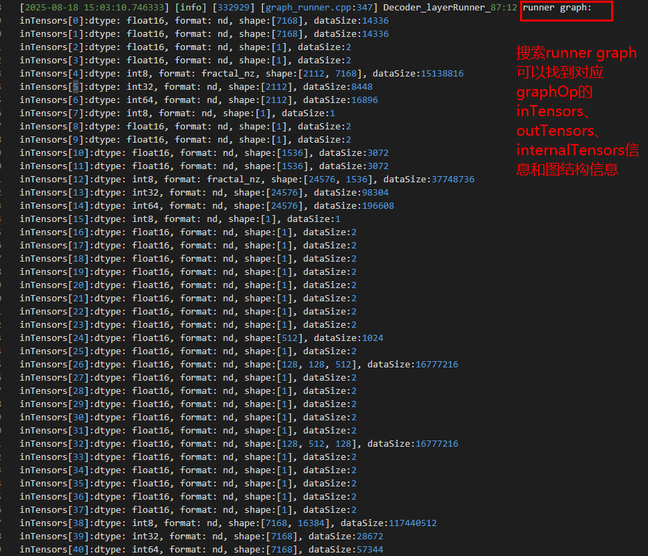
-->
`Decoder_layerRunner_87:12` indicates the 12th execution of Decoder_layerRunner at layer 87.
<!--
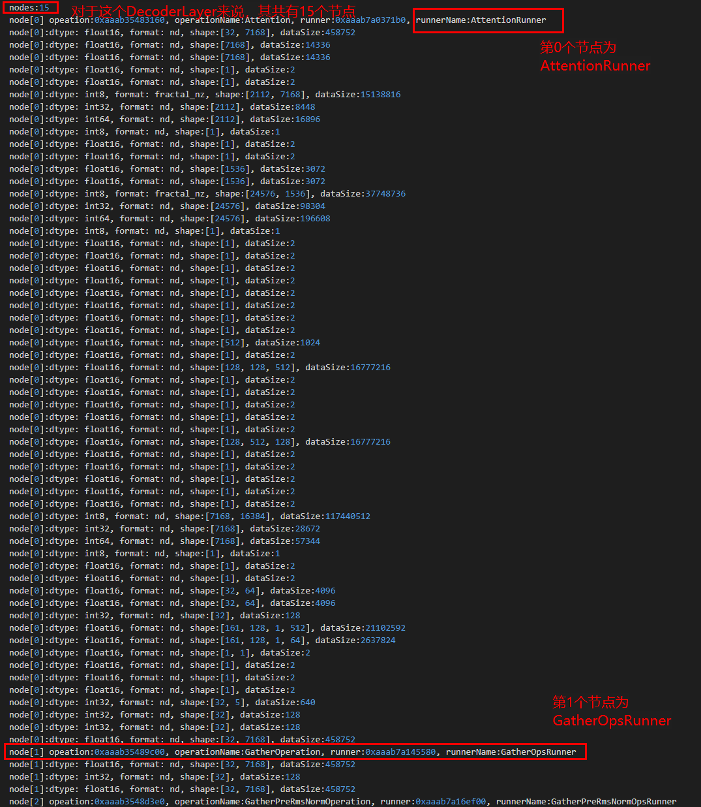
-->
To obtain detailed information about the 0th node `AttentionRunner` of Decoder_layerRunner, search for `AttentionRunner_87_0:12 runner graph`. `AttentionRunner` indicates the name of the node, and `87_0` indicates the 0th node of Decoder_layerRunner at layer 87.

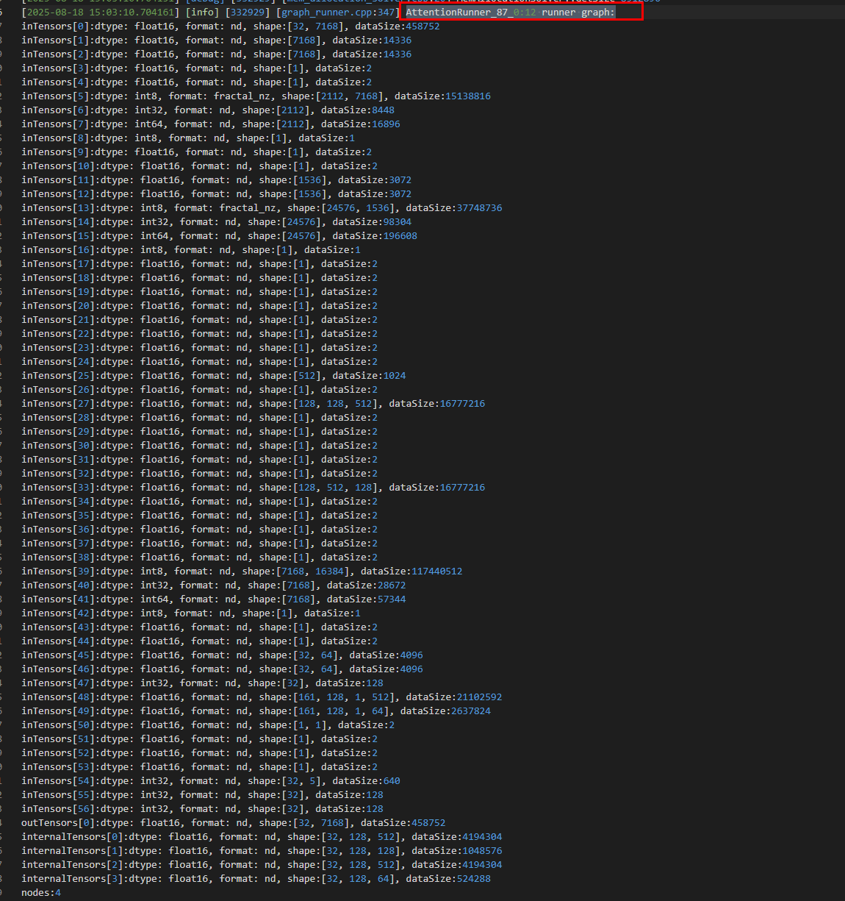
<!--
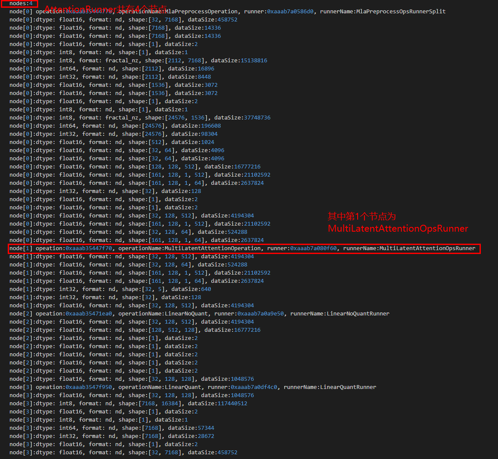
-->
Next, to view the actual param, inTensors, and outTensors of the MultiLatentAttention operator at runtime, search for `MultiLatentAttentionOpsRunner_87_0_1[0]` and look for the `launchParam` keyword. Similar to the above, `87_0_1[0]` indicates MultiLatentAttentionOpsRunner is the 0th operator of the 1st node of AttentionRunner (the 0th node of Decoder_layerRunner at layer 87).
<!--
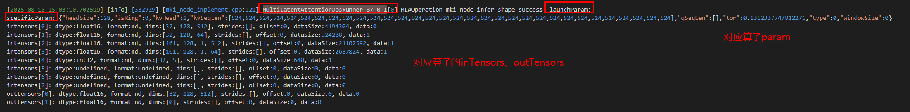
-->
# ATB Debugging Environment Variables

## Environment Variable Introduction

* `ATB_STREAM_SYNC_EVERY_OPERATION_ENABLE`: Locates the operation where the error is reported. When set to `1`, stream synchronization (aclrtSynchronizeStream) is performed after the execution of each operation.
* `ATB_STREAM_SYNC_EVERY_RUNNER_ENABLE`: Locates the runner where the error is reported. When set to `1`, stream synchronization is performed after the execution of each runner.
* `ATB_STREAM_SYNC_EVERY_KERNEL_ENABLE`: Locates the operator kernel where the error is reported. When set to `1`, stream synchronization is performed after the execution of each operator kernel.

## Example

The following uses the Decoder_layer of the LLaMA model collected by msProf as an example.

* Without any environment variables:
<!--
   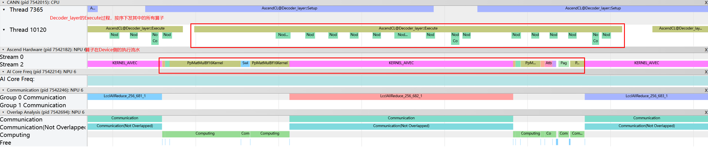
-->
* With `export ATB_STREAM_SYNC_EVERY_OPERATION_ENABLE=1`:
<!--
   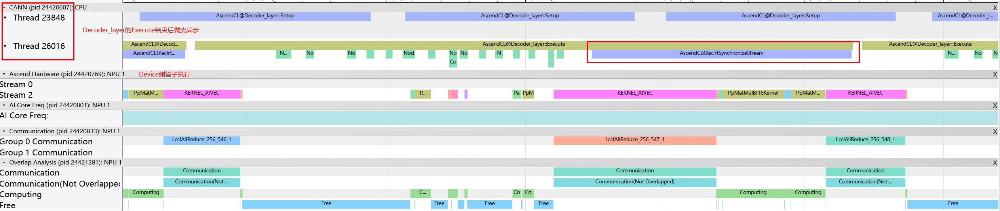
-->
* With `export ATB_STREAM_SYNC_EVERY_RUNNER_ENABLE=1`:
<!--
   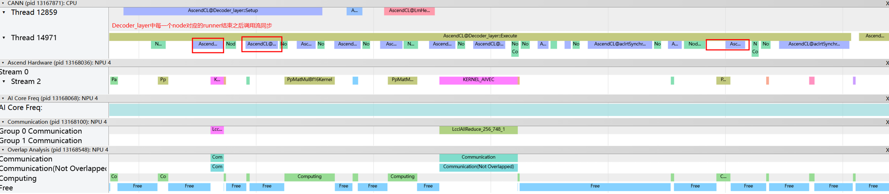
-->
* With `export ATB_STREAM_SYNC_EVERY_KERNEL_ENABLE=1`:
<!--
   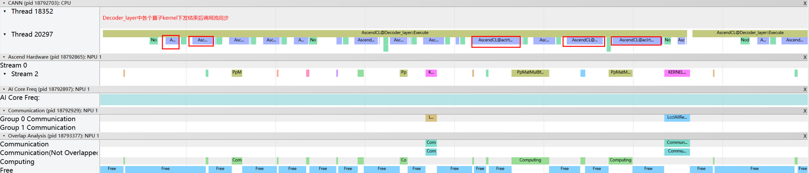
-->

# Recommended Debugging Tools

## Whole-Network Debugging for Model Graphs

This section introduces two commonly used debugging tools, `msProf` and `msit dump`. When using the ATB Graph Operation for model graphing, these tools target performance and precision, respectively.

### Performance

To understand the performance data of each operator in ATB graphs, you can use `msProf` to collect profile data and view the data using `chrome://tracing`.

1. Verify that the tool is available in the environment.

   First, check whether CANN/ascend-toolkit is installed and environment variables are configured: `echo $ASCEND_HOME_PATH`. If the path is not returned, re-run `source ${install_path}/set_env.sh`, where `${install_path}` is the CANN software installation directory.
2. Collecting Profile Data

   Run `msprof [options] --application=<app>`. For details about the command parameters, see [MindStudio Documentation](https://www.hiascend.com/document/detail/en/mindstudio/81RC1/T&ITools/Profiling/atlasprofiling_16_0008.html).

   * Using the demo in the ATB as an example: `cd ${home_path}/example/op_demo/mla_preprocess && msprof --application="bash build.sh"`
3. Viewing Profiling Data

   After profile data collection, msProf generates the `mindstudio_profiler_output` directory under the specified output directory. The following describes two most commonly used files:

   * `msprof_{timestamp}.json`: You can use `chrome://tracing` or `MindStudio Insight` to view the pipeline layout and operator execution time on the host and devices in the graph.
   * `op_summary_{timestamp}.csv`: You can view information about each operator used during graph execution, including the operator name, type, input and output tensors, execution time, and cache hit rate. This information can be used to analyze profile data and identify optimization opportunities.
4. Example

    * `msprof --application="bash build.sh"`: Runs the mla_preprocess case.
<!--
         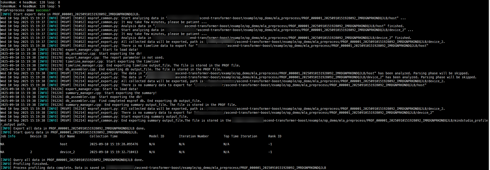

         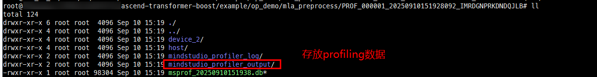

    * Viewing profile data:

         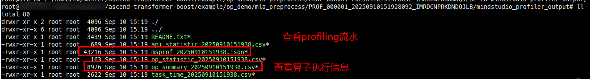

        * Profiling pipeline:
            Open the `msprof_{timestamp}.json` file using `chrome://tracing`.

            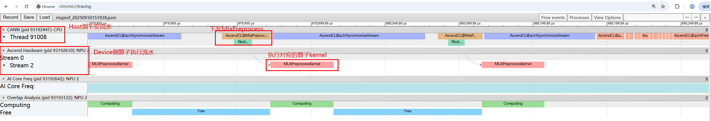
        * Operator profile data:

            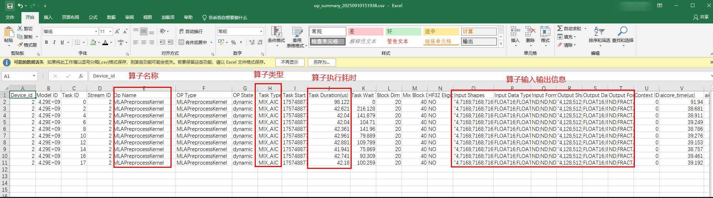
-->
### Precision

When encountering precision issues in the entire network, to locate the problematic operators, you can use `msit dump` to dump the input/output tensors and param data of each operator in the acceleration library graph for single operator validation.

#### Versions Prior to 8.5.0

1. Verify that the tool is available in the environment.

   First, check whether CANN/ascend-toolkit is installed and environment variables are configured: `echo $ASCEND_HOME_PATH`. If no target path is returned, re-run `source ${install_path}/set_env.sh`, where `${install_path}` indicates the installation directory of the CANN software. (Note that CANN versions prior to 8.2.RC2 do not collect data from the first run by default.)
2. Collect data.

   Run `msit llm dump --exec <app> (optional parameters)`. For details about the command parameters, see [DUMP Data Usage Description](https://gitcode.com/Ascend/msit/blob/26.0.0/msit/docs/llm/%E5%B7%A5%E5%85%B7-DUMP%E5%8A%A0%E9%80%9F%E5%BA%93%E6%95%B0%E6%8D%AE%E4%BD%BF%E7%94%A8%E8%AF%B4%E6%98%8E.md).

   * Using the demo in the ATB as an example: `cd ${home_path}/example/op_demo/mla_preprocess && msit llm dump --exec "bash build.sh" --type model tensor`

#### Versions 8.5.0 and Later

1. Download and install the tool package.

   * First, check whether CANN/ascend-toolkit is installed and environment variables are configured: `echo $ASCEND_HOME_PATH`. If the path is not returned, re-run `source ${install_path}/set_env.sh`, where `${install_path}` is the CANN software installation directory.
   * Compile and install the basic tool package and the atb_probe module.

   ```
   git clone https://gitcode.com/Ascend/msprobe.git
   cd msprobe

   pip install setuptools wheel

   python3 setup.py bdist_wheel --include-mod=atb_probe --no-check
   cd ./dist
   pip install ./mindstudio_probe*.whl
   ```

   * Create a `config.json` file in the current directory to configure dump parameters.

   ```
   {
    	"task": "tensor",
    	"dump_enable": true,
   	 "exec_range": "all",
    	"ids": "0",
    	"op_name": "",
    	"save_child": false,
    	"device": "",
    	"filter_level": 1
    }
   ```

   For details about the dump parameters, see the dump configuration file parameters in [Parameters](https://gitcode.com/Ascend/msprobe/blob/master/docs/en/dump/atb_data_dump_instruct.md#%E5%8F%82%E6%95%B0%E8%AF%B4%E6%98%8E).
2. Collect data.
   Run `pip show mindstudio-probe` to determine the installation path of msProbe. Assume that the installation path is `/usr/local/lib/python3.11/site-packages`. Run the following command to load the dump module:

   ```
   MSPROBE_HOME_PATH=/usr/local/lib/python3.11/site-packages
   source $MSPROBE_HOME_PATH/msprobe/scripts/atb/load_atb_probe.sh --output=$PWD --config=$PWD/config.json
   # The following uses the demo in the ATB as an example:
   cd ${home_path}/example/op_demo/mla_preprocess && bash build.sh
   ```

    For details about the command line parameters, see the command line parameter description in [Parameters](https://gitcode.com/Ascend/msprobe/blob/master/docs/en/dump/atb_data_dump_instruct.md#%E5%8F%82%E6%95%B0%E8%AF%B4%E6%98%8E).
3. View the data.

   * For the collected dump data, the directory structure corresponds to the ATB graph structure. The numbers before the operation name indicate the corresponding layer number of the model (e.g., `62_LmHead` indicates LmHead at layer 62). Subdirectories store all operations used in this layer, with numbers indicating the order (e.g., `0_GatherOperation` indicates the 0th operation in this layer is GatherOperation). The next level of subdirectories stores the operator kernels called by the operations, with numbers indicating the order (e.g., `0_Gather16I64Kernel` indicates the 0th operator called by this operation is Gather16I64Kernel).
   * The `before` and `after` directories in each directory store the tensor data before and after the graph execution for the current directory. The data in `before` shows information about the input tensors, and that in `after` shows information about the output tensors. You can read tensor data using methods such as `read_bin_data` provided by `msit`. For details, see [APIs - Reading and Saving Data](https://gitcode.com/Ascend/msit/blob/26.0.0/msit/docs/llm/API-%E8%AF%BB%E5%8F%96%E5%92%8C%E4%BF%9D%E5%AD%98%E6%8E%A5%E5%8F%A3.md).
   * `op_param.json` stores the param data used by the current operation during graph execution.
4. Example

   * Run a CSV case of topktoppSamplingOp (which contains multiple nodes).

      
   * View the dump tensor content. The numbers indicate the execution sequence of the operators. For example, the first operator is `TopKDescF16Kernel`, and the last operator is `LogProbsSampleKernel`.

      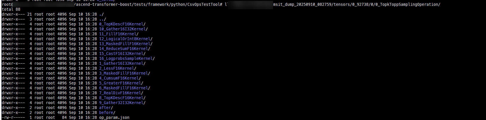
   * Take the first operator `TopkDescF16Kernel` as an example. The `after` directory stores `outTensors`, and the `before` directory stores `inTensors`.

      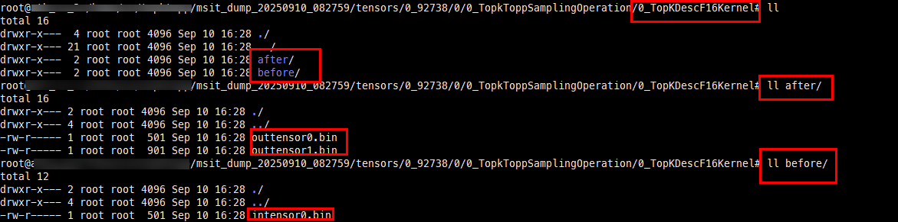
   * Read the tensor content. The following uses `intensor0` as an example.
<!--
      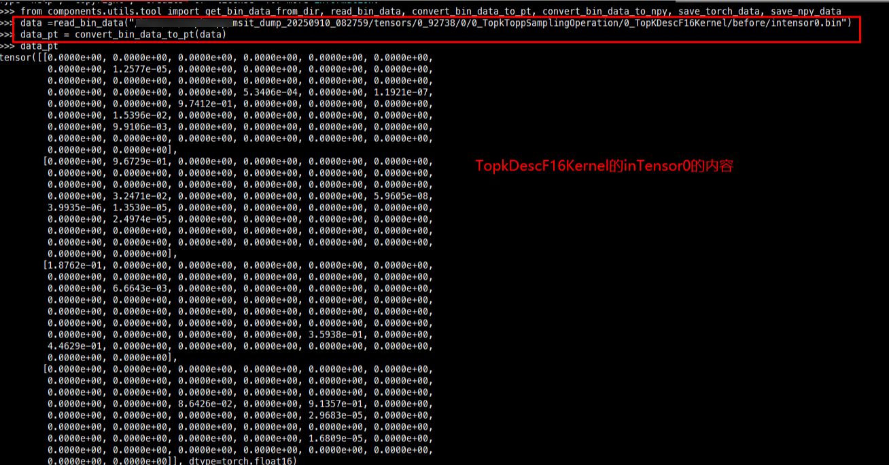
-->

## Single-Operator Debugging

This section describes the single-operator (operation) debugging of the ATB, which applies to debugging when developing operator kernel function code in the ATB. Two debugging features, msDebug and AscendC_Dump, are introduced below.

### msDebug

msDebug allows you to set breakpoints, perform single-step run, view kernel function variables, and view memory data on the NPUs for Ascend single-operator programs, enabling simultaneous debugging of CPU and NPU code within the same application. Just as `Ascend C` is an extension of `C`, using msDebug for debugging is a natural extension of using `gdb/lldb` for debugging. [Documentation](https://www.hiascend.com/document/detail/en/CANNCommunityEdition/83RC1alpha001/devaids/optool/atlasopdev_16_0062.html)

1. Verify that the function is available in the environment.

   To enable msDebug, install the NPU driver and firmware using either of the following methods (method 1 is recommended for CANN 8.1.RC1 and later, and driver 25.0.RC1 and later):

* Method 1: Specify the `--full` parameter during driver installation, then use the root user to run `echo 1 > /proc/debug_switch` to enable the debug channel.

  ```
  ./Ascend-hdk-<chip_type>-npu-driver_<version>_linux-<arch>.run --full
  ```

* Method 2: Specify the `--debug` parameter during driver installation. For detailed installation instructions, see [Installing NPU Driver Firmware](https://www.hiascend.com/document/detail/en/CANNCommunityEdition/83RC1alpha001/softwareinst/instg/instg_0005.html?Mode=PmIns&OS=Ubuntu&Software=cannToolKit).

  ```
  ./Ascend-hdk-<chip_type>-npu-driver_<version>_linux-<arch>.run --debug
  ```

2. Build the ATB with this function.

   Add the `--msdebug` option when building the ATB. Example: `bash scripts/build.sh testframework --msdebug`
   If an error similar to the following is displayed, it is because using `-O0 -g` to build operators when `--msdebug` is enabled causes the stack frame size to exceed the limit.
<!--
   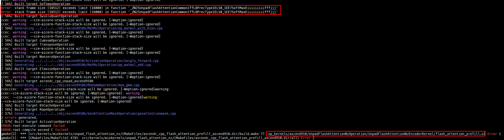
-->
   This error indicates that the limit was exceeded when building UnpadFlashAttentionNzEncoderKernel using Ascend 910. If you do not need to debug this operator, you can delete the corresponding content from `src/kernels/configs/mixkernels/op_list.yaml` in the source directory before the build. If it is an operator you need to debug, you need to modify the operator code to reduce the stack usage.
<!--
   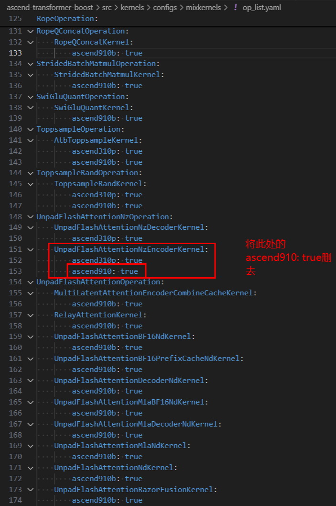
-->
3. Set environment variables.

   * After the build, set the environment variable `LAUNCH_KERNEL_PATH` to configure the `.o` file of the operator to debug. Example: `export LAUNCH_KERNEL_PATH={kernel.o}` (When building from the source code, the ATB's operator kernel `.o` files are located in the `build/op_kernels/` directory.)
   * Set the environment variables for the ATB: `source output/atb/set_env.sh`

4. Debug the operator.

   * Call the operator using `msdebug {Executable file or program}`. The following uses the test script `msdebug python3 test_faster_gelu.py` in the ATB as an example:
   * Common commands

        | Command                                      | Abbreviation                         | Function                                                                                                                                             | Example                                  |
        | ------------------------------------------ | --------------------------------- | ------------------------------------------------------------------------------------------------------------------------------------------------- | -------------------------------------- |
        | breakpoint filename:lineNo                 | b                                 | Set a breakpoint.                                                                                                                                         | b add\_custom.cpp:85<br>b my\_function |
        | run                                        | r                                 | Run again.                                                                                                                                         | r                                      |
        | continue                                   | c                                 | Resume running.                                                                                                                                         | c                                      |
        | print                                      | p                                 | Print variables.                                                                                                                                         | p zLocal                               |
        | frame variable                             | var                               | Print all variables in the current frame.                                                                                                                               | var                                    |
        | memory read                                | x                                 | Read memory.<br>`-m` specifies the memory location. GM, UB, L0A, L0B, and L0C are supported.<br>`-f` specifies the byte conversion format.<br>`-s` specifies the number of bytes to be printed in each line.<br>`-c` specifies the number of lines to be printed.                  | x -m GM -f float16[] 1000-c 2 -s 128   |
        | register read                              | re r                              | Read register values.<br>`-a` reads all register values.<br>`\$REG_NAME` reads the value of the register with the specified name.                                                                        | register read -are r \$PC              |
        | thread step-over                           | next<br>n                         | Move to the next executable line of code in the same call stack.                                                                                                     | n                                      |
        | ascend info devices                        | /                                 | Query device information.                                                                                                                                   | ascend info devices                    |
        | ascend info cores                          | /                                 | Query AI Core information for an operator.                                                                                                                   | ascend info cores                      |
        | ascend info tasks                          | /                                 | Query task information for an operator.                                                                                                                     | ascend info tasks                      |
        | ascend info stream                         | /                                 | Query stream information for an operator.                                                                                                                   | ascend info stream                     |
        | ascend info blocks                         | /                                 | Query block information for an operator.<br>Optional parameter: `-d/–details` displays the code of all blocks at the current breakpoint.                                                              | ascend info blocks                     |
        | ascend aic core                            | /                                 | Switch the target cube core of the debugger.                                                                                                                         | ascend aic 1                           |
        | ascend aiv core                            | /                                 | Switch the target vector core of the debugger.                                                                                                                       | ascend aiv 5                           |
        | target modules addkernel.o                 | image addkernel.o                 | Import operator debugging information when the PyTorch framework starts operators.<br>(Note: If this command is executed after the program has already been run with the `run` command,<br>an additional `image load` command is required to make the debugging information take effect.)| image addAddCustom\_xxx.o              |
        | target modules load –f kernel.o –s address | image load -f kernel.o -s address | Make the imported debugging information take effect after the program has run.                                                                                                               | image load -f AddCustom\_xxx.o -s 0    |

5. Example

   * `export LAUNCH_KERNEL_PATH={kernel.o}`: Set the operator to debug.
<!--
      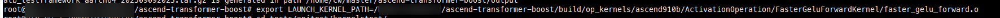
-->
   * `msdebug python3 test_faster_gelu.py`: Run the operator test case.
<!--
      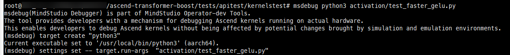
-->
   * `b faster_gelu_forward.h:{row_num}`: Set a breakpoint and run.
<!--
      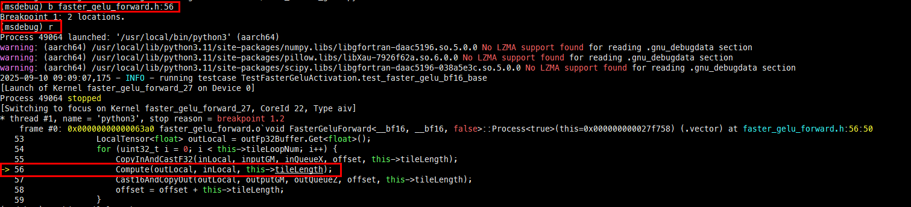
-->
   * `p inputGM`: Print variable content.
<!--
      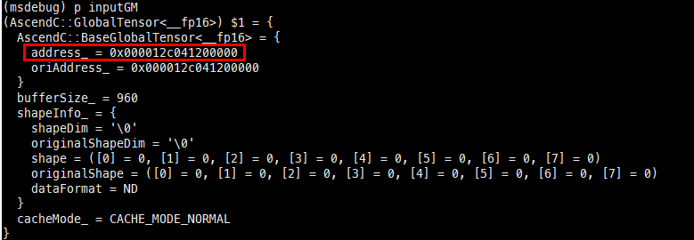
-->
   * `x -m GM -f float16[] -c 1 -s 768 0x000012c041200000`: Read the content of the corresponding memory.
<!--
      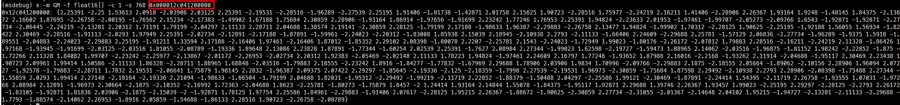
-->

### AscendC_Dump

ATB's `AscendC_Dump` allows users to add `AscendC::printf` and `AscendC::DumpTensor` interfaces in the kernel functions to print corresponding values when debugging operators in the ATB, facilitating debugging and localization. Note that this feature is for debugging purposes only and, when enabled, may impact the actual dispatch and execution of operators. It is not advised to enable this feature for models.

1. Verify that the tool is available in the environment.

   First, check whether CANN/ascend-toolkit is installed and environment variables are configured: `echo $ASCEND_HOME_PATH`. If the path is not returned, re-run `source ${install_path}/set_env.sh`, where `${install_path}` is the CANN software installation directory.
2. Add `AscendC::printf` and `AscendC::DumpTensor` to the kernel function of the corresponding operator.

   * `AscendC::printf`: This interface supports formatted output for debugging with CPUs and NPUs. Call the `printf` API to print required log information at the target position in the operator kernel implementation code. [Documentation](https://www.hiascend.com/document/detail/en/CANNCommunityEdition/83RC1alpha001/API/ascendcopapi/atlasascendc_api_07_0193.html)

     * Interface: `void AscendC::printf(__gm__ const char* fmt, Args&&... args)`
     * Parameter description:

        | Parameter| Input/Output| Description                                                                                                                                                                                                                                                                                                                                                                                                                                                                               |
        | ------ | --------- | ----------------------------------------------------------------------------------------------------------------------------------------------------------------------------------------------------------------------------------------------------------------------------------------------------------------------------------------------------------------------------------------------------------------------------------------------------------------------------------- |
        | fmt    | Input     | Format control string, which contains two types of objects: common characters and conversion descriptions. Supported conversion types:<br>`%d/%i`: Output decimal integers. Supported data types: bool, int8_t, int16_t, int32_t, int64_t<br>`%f`: Output a real number. Supported data types: float, half, bfloat16_t<br>`%x`: Output hexadecimal integers. Supported data types: int8_t, int16_t, int32_t, int64_t, uint8_t, uint16_t, uint32_t, uint64_t<br> `%s`: Output a string.<br> `%u`: Output unsigned data. Supported data types: bool, uint8_t, uint16_t, uint32_t, uint64_t<br>`%p`: Output pointer addresses.|
        | args   | Input     | Additional parameters (a parameter list with variable quantities and types). Depending on the `fmt` string, the function may require a series of additional parameters. Each parameter contains a value to be inserted and replaces each % tag specified in the `fmt` parameter. The number of parameters must match the number of `%` tags.                                                                                                                                                                                                                                                                                             |

   * `AscendC::DumpTensor`: Use this interface to dump the contents of a specified tensor. By now, it only supports printing tensor information stored in Unified Buffer, L1 Buffer, L0C Buffer, and Global Memory. [Documentation](https://www.hiascend.com/document/detail/en/CANNCommunityEdition/83RC1alpha001/API/ascendcopapi/atlasascendc_api_07_0192.html)
     * Function interfaces:

         ```
         # Printing without tensor shape
            template <typename T>
            __aicore__ inline void DumpTensor(const LocalTensor<T> &tensor, uint32_t desc, uint32_t dumpSize)
            template <typename T>
            __aicore__ inline void DumpTensor(const GlobalTensor<T>& tensor, uint32_t desc, uint32_t dumpSize)
         # Printing with tensor shape
            template <typename T>
            __aicore__ inline void DumpTensor(const LocalTensor<T>& tensor, uint32_t desc, uint32_t dumpSize, const ShapeInfo& shapeInfo)
            template <typename T>
            __aicore__ inline void DumpTensor(const GlobalTensor<T>& tensor, uint32_t desc, uint32_t dumpSize, const ShapeInfo& shapeInfo)
         ```

   * Parameter description:

       | Parameter   | Input/Output| Description                                              |
       | --------- | --------- | -------------------------------------------------- |
       | tensor    | Input     | The tensor to dump                                  |
       | decs      | Input     | User-defined additional information to identify the source of the dumped content      |
       | dumpSize  | Input     | Number of elements to dump                                |
       | shapeInfo | Input     | When passed as an input, the tensor's shape information can be printed as it is.|

3. Build the ATB with this function and set environment variables.

   * Add the build option `--ascendc_dump` when building the ATB. If you want to directly use the operator test cases (in the `kerneltest` directory) in the ATB, you need to use the test framework for the build. Example: `bash scripts/build.sh testframework --ascendc_dump`
   * Set the environment variable: `source {CODE_PATH}/output/atb/set_env.sh`

4. Run the corresponding operator.

   * Run the operator test cases in the ATB to call the operator.
     * Move to the test case directory: `cd {CODE_PATH}/tests/apitest/kernelstest`, where `{CODE_PATH}` is the path of the ATB source code.
     * Run the corresponding operator test case: `python3 {test_file}`. The test cases for the mix operator are in the `mix` folder (for example, `python3 mix/test_gating.py` for the gating operator).
   * Run the `op_demo` in the ATB to call the operator.
     * Move to the demo directory: `cd {CODE_PATH}/example/op_demo`, where `{CODE_PATH}` is the path of the ATB source code.
     * Run the corresponding operation example: `bash build.sh` (for example, `d mla_preprocess && bash build.sh` for the mla_preprocess operator).
5. Example

   * Add the corresponding print content to the `faster_gelu_forward` operator kernel function:

      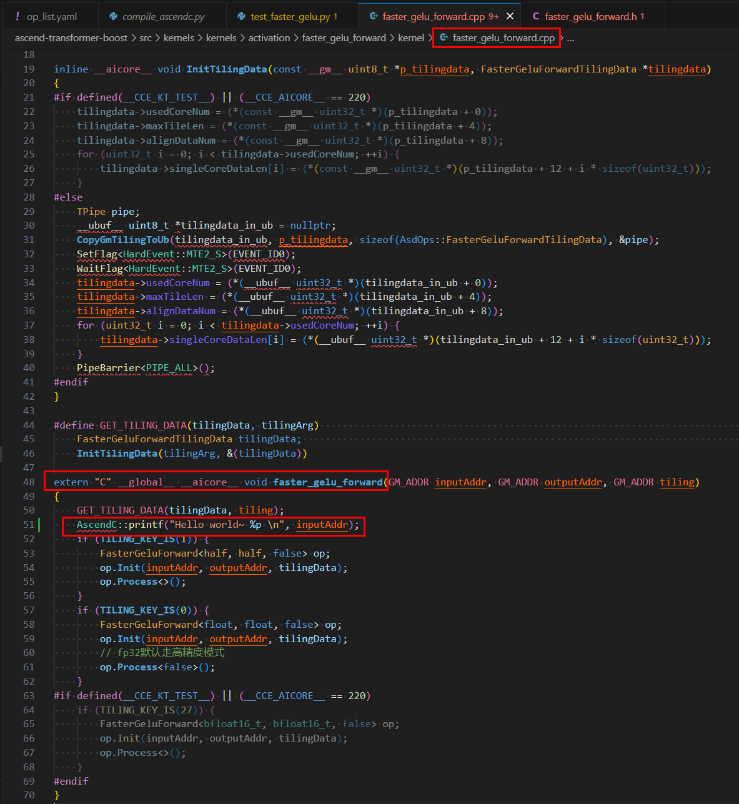

      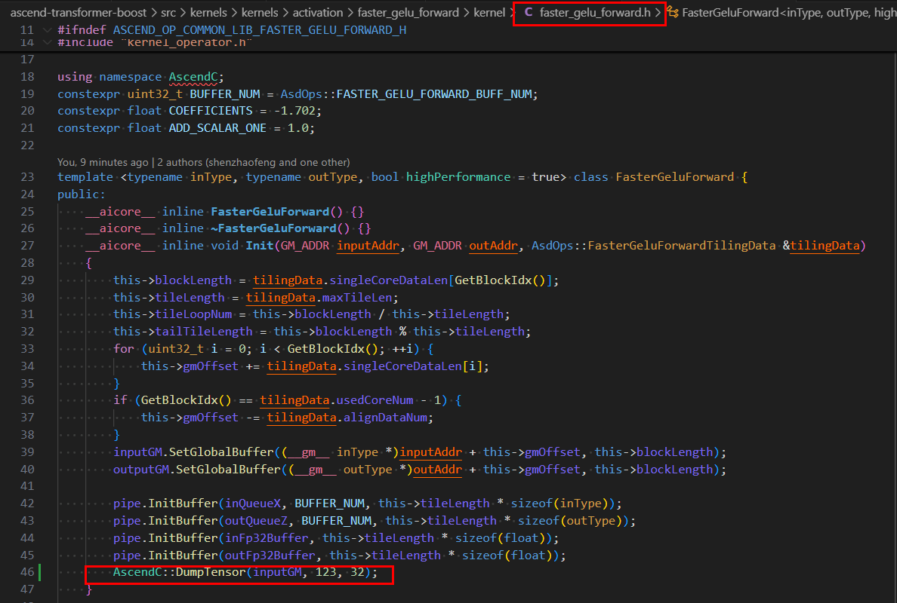
   * `bash scripts/build.sh testframework --ascendc_dump`: Build the ATB source code with the test framework.
   * `source output/atb/set_env.sh`: Set the environment variables of the ATB.
   * `cd tests/apitest/kernelstest`: Move to the test directory.
   * `python3 activation/test_faster_gelu.py`: Run the `faster_gelu_forward` operator test case.
<!--
      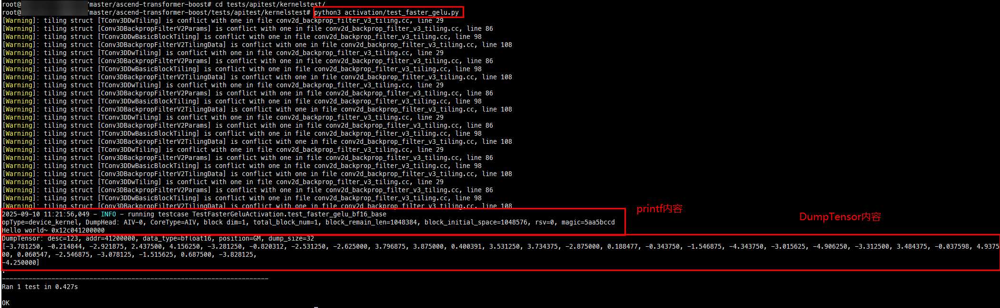
-->
