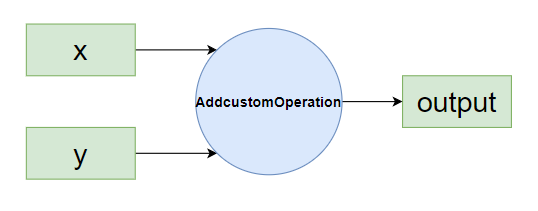

# Developing an Add Operator for the ATB from Scratch

This tutorial aims to get you started with the ATB. It does not focus on pursuing performance but strives to enable you to get the results locally within 30 minutes.

You can choose to develop new operators in the `ops_customize` directory. This avoids repeatedly building the ATB itself during development, improving your development efficiency. For details, refer to [README_en](https://gitcode.com/cann/ascend-transformer-boost/blob/master/ops_customize/README.md).

## ATB Operator Development Deliverables

The following figure shows the ATB operator development process:
<!--

-->
### Operator Functionality

Two input tensors are added along a specified dimension to produce one output tensor.


### New Files

- Create the `addcustom` directory under `src/kernels/kernels`. This directory stores certain operator implementation code. The specific file contents are described later. The directory structure is as follows:

    ```
    addcustom
    ├── op_kernel                                // Kernel-side implementation files (including the kernel function entry and implementation files)
    │   └── addcustom.cpp
    ├── tiling                                    // New operator tiling
    │   ├── addcustom_tiling.cpp	// Core tiling algorithm
    │   ├── addcustom_tiling.h		// Operator tiling interface
    │   └── tiling_data.h			// Definition of the tiling_data structure for passing between tiling and the kernel
    ├── CMakeLists.txt	                    // CMake file for building the new operator
    ├── addcustom_kernel.cpp           // Validation
    └── addcustom_operation.cpp             // Shape validation
    ```

- Create the `addcustom` directory under `src/ops/ops_infer`. This directory stores the code for integrating the addcustom operator into the ATB framework. The specific file contents are described later. The directory structure is as follows:

    ```
    addcustom
    ├── addcustom_operation.cpp          // ATB interface implementation
    ├── addcustom_operation.h
    ├── addcustom_ops_runner.cpp    // Operator graph
    └── addcustom_ops_runner.h
    ```

- Add the `src/kernels/include/asdops/params/addcustom.h` file to define the parameter structure of the `Addcustom` operation:

    ```c++
    #ifndef ATBOPS_PARAMS_ADDCUSTOM_H
    #define ATBOPS_PARAMS_ADDCUSTOM_H

    #include <cstdint>
    #include <string>
    #include <sstream>
    #include <mki/utils/SVector/SVector.h>

    namespace AsdOps {
    namespace OpParam {
    struct Addcustom {
        int addcustomDim = 0;

        bool operator==(const Addcustom &other) const
        {
            return this->addcustomDim == other.addcustomDim;
        }
    };

    } // namespace OpParam
    } // namespace AtbOps

    #endif
    ```

### Modified Files

- Add the new header file `src/kernels/include/asdops/params/addcustom.h` to `src/kernels/include/asdops/params/params.h`.

    ```c++
    #include "asdops/params/addcustom.h"
    ```

- `src/kernels/configs/kernels/op_list.yaml` does not exist on first build. After the build, add the following content. This operation is very important as it adds the new operator information to the list. Only then will the implementation and interface of the new operator truly complete in subsequent builds.

    ```
    AddcustomOperation:
        AddcustomKernel:
            ascend910b: true
     ```

- Add the following content to `include/atb/infer_op_params.h`:

    ```c++
    struct AddcustomParam {
        int addcustomDim = 0;
        uint8_t rsv[12] = {0};
    };
    ```

- Add the following content to `tests/framework/c++/atb_torch/operation/operation_funcs.cpp`:
  - Deserialize the `Addcustom` parameters described in JSON format into a C++ structure, and then use it to create or update the operator:

    ```c++
    static atb::Status AddcustomOperationCreate(const nlohmann::json &paramJson, atb::Operation **op)
    {
        atb::infer::AddcustomParam param;
        ATB_LOG(INFO) << "AddcustomParam axis:" << param.addcustomDim;
        if (paramJson.contains("addcustomDim")) {
            param.addcustomDim = paramJson["addcustomDim"].get<int>();
        }
        if (paramJson.contains("rsv")) {
            for (size_t i = 0; i < paramJson["rsv"].size(); i++) {
                param.rsv[i] = paramJson["rsv"].at(i).get<int8_t>();
            }
        }
        return CreateOperation(param, op);
    }
    ```

  - Add the corresponding key-value pair to `g_funcMap` in the file.

    ```c++
    {"AddcustomOperation", &AddcustomOperationCreate},
    ```

- Add the operator description to `ops_configs/atb_ops_info.ini`.

    ```
    [AddcustomOperation]
    input0.name=x
    input0.dtype=int32
    input0.format=nd
    input1.name=y
    input1.dtype=int32
    input1.format=nd
    output0.name=output
    output0.dtype=int32
    output0.format=nd
    ```

- Add the following content to `src/atb/utils/param_to_json.cpp`:

    ```c++
    template <> nlohmann::json OpParamToJson(const infer::AddcustomParam &opParam)
    {
        nlohmann::json paramsJson;
        paramsJson["addcustomDim"] = opParam.addcustomDim;
        return paramsJson;
    }
    ```

## Environment Setup

You can refer to [Environment Setup](../README_en.md#2-environment-setup) to set up the build and test environments. Once they are ready, you can begin your ATB operator development journey.

## ATB Operator Implementation

This process involves operator implementation on the kernel and tiling on the host.

### Tiling

For core concepts in tiling, such as `TilingData`, `Workspace`, `TilingKey`, and `BlockDim`, refer to the [glossary](https://www.hiascend.com/document/detail/en/CANNCommunityEdition/850alpha001/opdevg/Ascendcopdevg/atlas_ascendc_10_00013.html).

#### tiling_data.h

File path: `src/kernels/kernels/addcustom/tiling/tiling_data.h`
Function: Defines the structure of the block information during data tiling.

```c++
#ifndef ASCEND_OPS_ADDCUSTOM_TILING_DATA
#define ASCEND_OPS_ADDCUSTOM_TILING_DATA

#include <cstdint>

namespace AsdOps {
struct AddcustomTilingData {
    uint32_t totalLength;  // Total data length
    uint32_t tileNum;      // Number of tiling blocks
};
}
#endif  // ASCEND_OPS_ADD_CUSTOM_TILING_DATA
```

#### addcustom_tiling.h

File path: `src/kernels/kernels/addcustom/tiling/addcustom_tiling.h`
Function: This process tiles data. Therefore, the main function is the one that implements the tiling functionality. Here is the function declaration.

```c++
#ifndef ASCEND_OPS_ADDCUSTOM_TILING_H
#define ASCEND_OPS_ADDCUSTOM_TILING_H

#include <mki/launch_param.h>
#include <mki/kernel_info.h>
#include <mki/utils/status/status.h>

namespace AsdOps {
using namespace Mki;
Status AddcustomTiling(const LaunchParam &launchParam, KernelInfo &kernelInfo);
} // namespace AsdOps

#endif
```

#### addcustom_tiling.cpp

File path: `src/kernels/kernels/addcustom/tiling/addcustom_tiling.cpp`
Function: Implements the main function for tiling.

```c++
#include "addcustom_tiling.h"
#include <mki/utils/assert/assert.h>
#include <mki/utils/log/log.h>
#include <mki/utils/platform/platform_info.h>
#include <mki/utils/math/math.h>
#include <mki/utils/SVector/SVector.h>
#include "asdops/params/addcustom.h"
#include "tiling_data.h"

// Define the minimum block length.
constexpr uint32_t MIN_BLOCK_LENGTH = 1;

namespace AsdOps {
Status AddcustomTiling(const LaunchParam &launchParam, KernelInfo &kernelInfo)
{
    AddcustomTilingData *tilingDataPointer =
        reinterpret_cast<AddcustomTilingData *>(kernelInfo.GetTilingHostAddr());
    MKI_CHECK(tilingDataPointer != nullptr, "tilingDataPtr should not be empty",
              return Status::FailStatus(ERROR_INVALID_VALUE, "tilingDataPtr should not be empty"));

    if (launchParam.GetParam().Type() != typeid(OpParam::Addcustom)) {
        return Status::FailStatus(
            ERROR_ATTR_INVALID_TYPE,
            "Failed to check addcustom param, type of specificParam is not equals to OpParam::Addcustom");
    }

    // Obtain the dimension of the input tensor.
    const uint32_t totalLength = launchParam.GetInTensor(0).desc.dims.at(0);
    MKI_LOG(INFO) << "Total length is " << totalLength;

    // Get the number of cores.
    uint32_t coreNum = PlatformInfo::Instance().GetCoreNum(CoreType::CORE_TYPE_VECTOR);
    MKI_LOG(INFO) << "Core number is " << coreNum;

    // Get the number of blocks per core.
    uint32_t blockDims = std::min<uint32_t>((totalLength + MIN_BLOCK_LENGTH - 1) / MIN_BLOCK_LENGTH, coreNum);
    tilingDataPointer->tileNum = blockDims;
    tilingDataPointer->totalLength = totalLength;

    MKI_LOG(INFO) << "BlockDims is " << blockDims;
    MKI_LOG(INFO) << "Total length is " << tilingDataPointer->totalLength;
    MKI_LOG(INFO) << "Tile number is " << tilingDataPointer->tileNum;

    kernelInfo.SetBlockDim(blockDims);
    return Status::OkStatus();
}
} // namespace AsdOps
```

### Kernel Development

For concepts related to the kernel, such as `Compute`, `CopyIn`, and `CopyOut`, refer to the [glossary](https://www.hiascend.com/document/detail/en/CANNCommunityEdition/850alpha001/opdevg/Ascendcopdevg/atlas_ascendc_10_00013.html).

#### addcustom.cpp

File path: `src/kernels/kernels/addcustom/op_kernel/addcustom.cpp`
Function: Moves and computes all data based on the tiling information.

```c++
#include "kernel_operator.h"
#include "kernels/utils/kernel/kernel_utils.h"
#include "kernels/addcustom/tiling/tiling_data.h"
using namespace AscendC;

static constexpr uint32_t BUFFER_NUM = 2;
static constexpr uint32_t MAX_UB_SIZE = 188 * 1024; // Double buffer, 94 KB per buffer, 188 KB in total

class Addcustom {
public:
    __aicore__ inline Addcustom() {}
    __aicore__ inline void Init(GM_ADDR x, GM_ADDR y, GM_ADDR z, AsdOps::AddcustomTilingData *tdata)
    {
        this->totalLength = tdata->totalLength;
        this->tileNum = tdata->tileNum;
        this->blockLength = totalLength / GetBlockNum();
        this->tileLength = blockLength / tileNum / BUFFER_NUM;

        // Set the start address and total length of global variables.
        xGm.SetGlobalBuffer((__gm__ float *)x, totalLength * sizeof(float));
        yGm.SetGlobalBuffer((__gm__ float *)y, totalLength * sizeof(float));
        zGm.SetGlobalBuffer((__gm__ float *)z, totalLength * sizeof(float));

        // Initialize pipes and queues.
        pipe.InitBuffer(inQueueX, BUFFER_NUM, tileLength * sizeof(float));
        pipe.InitBuffer(inQueueY, BUFFER_NUM, tileLength * sizeof(float));
        pipe.InitBuffer(outQueueZ, BUFFER_NUM, tileLength * sizeof(float));
    }
    __aicore__ inline void Process()
    {
        for (int32_t i = 0; i < tileNum; i++) {
            CopyIn(i);
            Compute(i);
            CopyOut(i);
        }
    }

private:
    __aicore__ inline void CopyIn(int32_t progress)
    {
        // Allocate local memory.
        LocalTensor<float> xLocal = inQueueX.AllocTensor<float>();
        LocalTensor<float> yLocal = inQueueY.AllocTensor<float>();

        // Copy data from the global memory to the local memory.
        DataCopy(xLocal, xGm[progress * tileLength], tileLength * sizeof(float));
        DataCopy(yLocal, yGm[progress * tileLength], tileLength * sizeof(float));

        // Enqueue the local memory.
        inQueueX.EnQue(xLocal);
        inQueueY.EnQue(yLocal);
    }
    __aicore__ inline void Compute(int32_t progress)
    {
        // Dequeue the local memory.
        LocalTensor<float> xLocal = inQueueX.DeQue<float>();
        LocalTensor<float> yLocal = inQueueY.DeQue<float>();
        LocalTensor<float> zLocal = outQueueZ.AllocTensor<float>();

        // Perform element-wise addition.
        Add(zLocal, xLocal, yLocal, tileLength);

        // Enqueue the result into the output queue.
        outQueueZ.EnQue(zLocal);

        // Free the input local memory.
        inQueueX.FreeTensor(xLocal);
        inQueueY.FreeTensor(yLocal);
    }
    __aicore__ inline void CopyOut(int32_t progress)
    {
        // Dequeue the local memory from the output queue.
        LocalTensor<float> zLocal = outQueueZ.DeQue<float>();

        // Copy the result from the local memory to the global memory.
        DataCopy(zGm[progress * tileLength], zLocal, tileLength * sizeof(float));

        // Free the local memory.
        outQueueZ.FreeTensor(zLocal);
    }

private:
    TPipe pipe;
    TQue<QuePosition::VECIN, BUFFER_NUM> inQueueX, inQueueY;
    TQue<QuePosition::VECOUT, BUFFER_NUM> outQueueZ;
    GlobalTensor<float> xGm;
    GlobalTensor<float> yGm;
    GlobalTensor<float> zGm;
    uint32_t totalLength;
    uint32_t tileNum;
    uint32_t blockLength;
    uint32_t tileLength;
};

inline __aicore__ void InitTilingData(const __gm__ uint8_t *p_tilingdata, AsdOps::AddcustomTilingData *tilingdata)
{
    tilingdata->totalLength = ((const __gm__ uint32_t *)p_tilingdata)[0];
    tilingdata->tileNum = ((const __gm__ uint32_t *)p_tilingdata)[1];
}

extern "C" __global__ __aicore__ void addcustom(GM_ADDR x, GM_ADDR y, GM_ADDR z, GM_ADDR tiling)
{
    Addcustom op;
    AsdOps::AddcustomTilingData tdata;
    InitTilingData(tiling, &tdata);
    op.Init(x, y, z, &tdata);
    op.Process();
}
```

#### addcustom_kernel.cpp

File path: `src/kernels/kernels/addcustom/addcustom_kernel.cpp`
Function: Checks the inputs and outputs and performs kernel-side initialization before launching the kernel-side implementation.

```c++
#include <mki/base/kernel_base.h>
#include <mki_loader/op_register.h>
#include <mki/utils/assert/assert.h>
#include <mki/utils/log/log.h>
#include "asdops/params/params.h"
#include "kernels/addcustom/tiling/addcustom_tiling.h"
#include "kernels/addcustom/tiling/tiling_data.h"

namespace AsdOps {

class AddcustomKernel : public KernelBase {
public:
    explicit AddcustomKernel(const std::string &kernelName, const BinHandle *handle) noexcept
        : KernelBase(kernelName, handle)
    {
    }

    /* --------- Framework callback --------- */
    bool CanSupport(const LaunchParam &launchParam) const override
    {
        MKI_CHECK(launchParam.GetParam().Type() == typeid(OpParam::Addcustom),
                     "Addcustom valid: param type invalid", return false);
        return true;
    }

    uint64_t GetTilingSize(const LaunchParam &launchParam) const override
    {
        (void)launchParam;
        return sizeof(AddcustomTilingData);
    }

    Status InitImpl(const LaunchParam &launchParam) override
    {
        return AddcustomTiling(launchParam, kernelInfo_);   // Reuse the above tiling function.
    }
};

/* ---------- Registration with the framework ---------- */
REG_KERNEL_BASE(AddcustomKernel);

}   // namespace AsdOps
```

#### addcustom_operation.cpp

File path: `src/kernels/kernels/addcustom/addcustom_operation.cpp`
Function: Selects the optimal kernel function.

```c++
#include <mki/base/operation_base.h>
#include <mki_loader/op_register.h>
#include <mki/utils/log/log.h>
#include "asdops/params/params.h"

namespace AsdOps {
using namespace Mki;

static constexpr int32_t INPUT_NUM  = 2;
static constexpr int32_t OUTPUT_NUM = 1;

class AddcustomOperation : public OperationBase {
public:
    explicit AddcustomOperation(const std::string &opName) noexcept : OperationBase(opName) {}

    /* ---------- Kernel selection ---------- */
    Kernel *GetBestKernel(const LaunchParam &launchParam) const override
    {
        MKI_CHECK(IsConsistent(launchParam), "Fail to check consistent", return nullptr);

        MKI_CHECK(launchParam.GetParam().Type() == typeid(OpParam::Addcustom),
                     "OpParam invalid", return nullptr);

        auto dtype = launchParam.GetInTensor(0).desc.dtype;
        MKI_CHECK(dtype == TENSOR_DTYPE_INT32,
                     "Only int32 supported", return nullptr);

        return GetKernelByName("AddcustomKernel");   // The kernel name must be the same as that registered.
    }

    /* ---------- Tensor count ---------- */
    int64_t GetInputNum(const Any &specificParam) const override
    {
        (void)specificParam;
        return INPUT_NUM;
    }

    int64_t GetOutputNum(const Any &specificParam) const override
    {
        (void)specificParam;
        return OUTPUT_NUM;
    }

protected:
    /* ---------- Shape inference ---------- */
    Status InferShapeImpl(const LaunchParam &launchParam,
                          SVector<Tensor> &outTensors) const override
    {
        MKI_CHECK(launchParam.GetParam().Type() == typeid(OpParam::Addcustom),
                     "no match param type",
                     return Status::FailStatus(ERROR_INFERSHAPE_ERROR, "OpParam invalid"));

        /* Output shape = Input shape */
        outTensors[0].desc = launchParam.GetInTensor(0).desc;
        return Status::OkStatus();
    }
};

/* ---------- Registration ---------- */
REG_OPERATION(AddcustomOperation);

}  // namespace AsdOps
```

## ATB Framework Integration

Compared with non-ATB operator development, after implementing the ATB operator, you need to develop interfaces to integrate the operator implementation into ATB. The integration process includes the development of `Runner` and `Operation`.
**Operation**: `Operation` is the user-facing front-end interface in the ATB for creating and managing operators. You can execute operators by creating an `Operation` object.
**Runner**: The execution unit of an `Operation`. It can be understood as the back-end processing logic of an `Operation`. A `Runner` is responsible for specifically executing the operator's computation tasks, including calling kernel functions, managing device memory, and processing tiling data.

### Runner

#### addcustom_ops_runner.h

File path: `src/ops/ops_infer/addcustom/addcustom_ops_runner.h`
Function: The declaration header file for back-end processing logic functions

```c++
#ifndef ATB_ADDCUSTOM_OPS_RUNNER_H
#define ATB_ADDCUSTOM_OPS_RUNNER_H

#include "atb/infer_op_params.h"
#include "atb/runner/ops_runner.h"

namespace atb {

class AddcustomOpsRunner : public OpsRunner {
public:
    explicit AddcustomOpsRunner(const infer::AddcustomParam &param);
    ~AddcustomOpsRunner() override = default;

protected:
    Status SetupKernelGraph(const OpsTensorPack &opsTensorPack) override;
    Status SetupKernelGraphAddInt32();
private:
    infer::AddcustomParam param_;
};

}  // namespace atb
#endif  // ATB_ADDCUSTOM_OPS_RUNNER_H
```

#### addcustom_ops_runner.cpp

File path: `src/ops/ops_infer/addcustom/addcustom_ops_runner.cpp`
Function: Backend processing logic

```c++
#include "addcustom_ops_runner.h"
#include <asdops/params/params.h>
#include <atb/utils/log.h>
#include "atb/utils/operation_register.h"
#include "atb/utils/param_compare.h"

namespace atb {

AddcustomOpsRunner::AddcustomOpsRunner(const infer::AddcustomParam &param)
    : OpsRunner("AddcustomOpsRunner"), param_(param)
{
    ATB_LOG(INFO) << "AddcustomOpsRunner::AddcustomOpsRunner";
}

/* ---------- Framework callback ---------- */
Status AddcustomOpsRunner::SetupKernelGraph(const OpsTensorPack &opsTensorPack)
{
    (void)opsTensorPack;   // No additional validation required.

    const size_t inTensorNum  = 2;
    const size_t outTensorNum = 1;
    const size_t nodeNum      = 1;

    kernelGraph_.inTensors.resize(inTensorNum);
    kernelGraph_.outTensors.resize(outTensorNum);
    kernelGraph_.internalTensors.clear();
    kernelGraph_.nodes.resize(nodeNum);

    return SetupKernelGraphAddInt32();
}

/* ---------- Computation graph creation ---------- */
Status AddcustomOpsRunner::SetupKernelGraphAddInt32()
{
    ATB_LOG(INFO) << GetLogPrefix() << "AddcustomOpsRunner::SetupKernelGraphAddInt32";

    /* Input 0: x; input 1: y */
    Mki::Tensor &xTensor = kernelGraph_.inTensors[0];
    Mki::Tensor &yTensor = kernelGraph_.inTensors[1];

    /* Output 0: z = x + y */
    Mki::Tensor &zTensor = kernelGraph_.outTensors[0];

    /* Single Addcustom compute node */
    KernelGraphNode &addNode = kernelGraph_.nodes[0];

    AsdOps::OpParam::Addcustom addParam{param_.addcustomDim}; // If not required, set it to 0.
    addNode.opDesc    = {0, "AddcustomOperation", addParam};
    addNode.inTensors = {&xTensor, &yTensor};
    addNode.outTensors = {&zTensor};

    return NO_ERROR;
}

// Register the current runner: AddCustomOpsRunner, which must be the same as the current runner name. Ensure that the runner name is unique to avoid duplicate registration.
REG_RUNNER_TYPE(AddcustomOpsRunner);
// Register the new operator parameter AsdOps::OpParam::Addcustom used in the current runner. Ensure that the operator parameter is unique to avoid duplicate registration.
REG_OP_PARAM(AsdOps::OpParam::Addcustom);
}  // namespace atb
```

### Operation

#### addcustom_operation.h

File path: `src/ops/ops_infer/addcustom/addcustom_operation.h`
Function: The declaration header file for creating and managing operator functions

```c++
#ifndef ATB_Addcustom_OPERATION_H
#define ATB_Addcustom_OPERATION_H

#include "atb/infer_op_params.h"
#include "atb/operation/operation_base.h"

namespace atb {

class AddcustomOperation : public OperationBase {
public:
    explicit AddcustomOperation(const infer::AddcustomParam &param);
    ~AddcustomOperation() override = default;

    uint32_t GetInputNum()  const override;
    uint32_t GetOutputNum() const override;

protected:
    Status InferShapeImpl(const SVector<TensorDesc> &inTensorDescs,
                          SVector<TensorDesc> &outTensorDescs) const override;
    Status InferShapeCheckImpl(const SVector<TensorDesc> &inTensorDescs) const override;
    Status SetupCheckImpl(const SVector<Tensor> &inTensors,
                          const SVector<Tensor> &outTensors) const override;
    std::shared_ptr<Runner> CreateRunner(Context &context) const override;
    nlohmann::json GetParamJson() const override;

private:
    Status InTensorDescsCheck(const SVector<TensorDesc> &inTensorDescs) const;

private:
    infer::AddcustomParam param_;
};

} // namespace atb
#endif
```

#### addcustom_operation.cpp

File path: `src/ops/ops_infer/addcustom/addcustom_operation.cpp`
Function: The file for creating and managing operator functions

```c++
#include "addcustom_operation.h"

#include "addcustom_ops_runner.h"
#include "atb/operation/atb_operation_ir_cfg.h"
#include "atb/operation/op_param_funcs.h"
#include "atb/utils/operation_util.h"
#include "atb/utils/param_to_json.h"
#include "atb/utils/singleton.h"
#include "atb/utils/tensor_check.h"

namespace atb {

/* ---------- Factory function ---------- */
template <>
Status CreateOperation(const infer::AddcustomParam &opParam, Operation **operation)
{
    if (operation == nullptr) return ERROR_INVALID_PARAM;
    OP_PARAM_RSV_CHECK(opParam);

    *operation = new (std::nothrow) AddcustomOperation(opParam);
    if (*operation == nullptr) {
        ATB_LOG(ERROR) << "failed to new AddcustomOperation";
        return ERROR_INTERNAL_ERROR;
    }
    return NO_ERROR;
}

/* ---------- Construction/Destruction ---------- */
AddcustomOperation::AddcustomOperation(const infer::AddcustomParam &param)
    : OperationBase("AddcustomOperation"), param_(param)
{
    operationIr_ = GetSingleton<AtbOperationIrCfg>().GetOperationIr("AddcustomOperation");
}

/* ---------- Number of inputs/outputs ---------- */
uint32_t AddcustomOperation::GetInputNum() const { return 2; }
uint32_t AddcustomOperation::GetOutputNum() const { return 1; }

/* ---------- Shape inference ---------- */
Status AddcustomOperation::InferShapeImpl(const SVector<TensorDesc> &inTensorDescs,
                                          SVector<TensorDesc> &outTensorDescs) const
{
    outTensorDescs[0] = inTensorDescs[0]; // The output is identical to input 0.
    return NO_ERROR;
}

/* ---------- Validation ---------- */
Status AddcustomOperation::InferShapeCheckImpl(const SVector<TensorDesc> &inTensorDescs) const
{
    return InTensorDescsCheck(inTensorDescs);
}

Status AddcustomOperation::SetupCheckImpl(const SVector<Tensor> &inTensors, const SVector<Tensor> &outTensors) const
{
    SVector<TensorDesc> inTensorDescs;
    OperationUtil::InTensorsToInTensorDescs(inTensors, inTensorDescs);
    ATB_LOG(DEBUG) << "outTensors size:" << outTensors.size();

    return InTensorDescsCheck(inTensorDescs);
}

/* ---------- Runner creation ---------- */
std::shared_ptr<Runner> AddcustomOperation::CreateRunner(Context &context) const
{
    (void)context;
    return std::make_shared<AddcustomOpsRunner>(param_);
}

/* ---------- Parameter JSON ---------- */
nlohmann::json AddcustomOperation::GetParamJson() const { return OpParamToJson(param_); }

/* ---------- Specific validation ---------- */
Status AddcustomOperation::InTensorDescsCheck(const SVector<TensorDesc> &inTensorDescs) const
{
    // Count
    if (inTensorDescs.size() != 2) {
        ATB_LOG(ERROR) << GetLogPrefix() << "Addcustom expect 2 inputs";
        return ERROR_INVALID_PARAM;
    }

    // shape
    if (inTensorDescs[0].shape.dimNum != inTensorDescs[1].shape.dimNum) {
        ATB_LOG(ERROR) << GetLogPrefix() << "Addcustom inputs must have same shape";
        return ERROR_INVALID_PARAM;
    }
    return NO_ERROR;
}

}  // namespace atb
```

## Building and Testing

### CMakeLists.txt

File path: `src/kernels/kernels/addcustom/CMakeLists.txt`
Function: File build

```
set(addcustom_srcs
    ${CMAKE_CURRENT_LIST_DIR}/addcustom_operation.cpp
    ${CMAKE_CURRENT_LIST_DIR}/addcustom_kernel.cpp
    ${CMAKE_CURRENT_LIST_DIR}/tiling/addcustom_tiling.cpp
)

add_operation(AddcustomOperation "${addcustom_srcs}")

add_kernel(addcustom ascend910b vector
    op_kernel/addcustom.cpp
    AddcustomKernel)
```

### ATB Build and Environment Variable Settings

The build script file for the ATB is `scripts/build.sh`, and the basic command to use is:

```shell
bash scripts/build.sh
```

After the build, set the environment variables.

```shell
source output/atb/set_env.sh
```

### Testing

In the `example/op_demo` directory, there are multiple operator call demos that do not depend on a test framework and can run immediately after build. After developing an operator, you can write test cases to test its functionality. For details about how to write test cases, check [this guide](https://www.hiascend.com/document/detail/en/CANNCommunityEdition/850alpha001/acce/ascendtb/ascendtb_0046.html).
Create the `example/op_demo/addcustom` folder. The directory structure of the operator call sample is as follows:

```
addcustom
├── addcustom_demo.cpp    // Code file of the call sample
└── build.sh            // Build file
```

#### addcustom_demo.cpp

File path: `example/op_demo/addcustom/addcustom_demo.cpp`
Function: Creates and calls `AddcustomOperation`.

```c++
#include "../demo_util.h"

const int32_t DEVICE_ID = 0;
const uint32_t DIM_0 = 8;
const uint32_t DIM_1 = 512;

/**
 * @brief Prepare the input tensors for Addcustom (both inputs have the same shape).
 */
atb::Status PrepareInTensor(atb::Context *contextPtr, aclrtStream stream, atb::SVector<atb::Tensor> &inTensors)
{
    // Input x: [8, 512], int32, all ones
    atb::Tensor x;
    CHECK_STATUS(CreateTensorFromVector(contextPtr, stream, std::vector<int32_t>(DIM_0 * DIM_1, 1), ACL_INT32,
                                        aclFormat::ACL_FORMAT_ND, {DIM_0, DIM_1}, x));

    // Input y: [8, 512], int32, all twos
    atb::Tensor y;
    CHECK_STATUS(CreateTensorFromVector(contextPtr, stream, std::vector<int32_t>(DIM_0 * DIM_1, 2), ACL_INT32,
                                        aclFormat::ACL_FORMAT_ND, {DIM_0, DIM_1}, y));

    inTensors = {x, y};
    return atb::ErrorType::NO_ERROR;
}

/**
 * @brief Create an AddcustomOperation.
 */
atb::Status CreateAddcustomOperation(atb::Operation **addOp)
{
    atb::infer::AddcustomParam param;
    param.addcustomDim = 0;
    CHECK_STATUS(atb::CreateOperation(param, addOp));
    return atb::ErrorType::NO_ERROR;
}

int main(int argc, char **argv)
{
    CHECK_STATUS(aclInit(nullptr));
    int32_t deviceId = 0;
    CHECK_STATUS(aclrtSetDevice(deviceId));

    atb::Context *context = nullptr;
    CHECK_STATUS(atb::CreateContext(&context));
    void *stream = nullptr;
    CHECK_STATUS(aclrtCreateStream(&stream));
    context->SetExecuteStream(stream);

    /* OP creation */
    atb::Operation *addOp = nullptr;
    CHECK_STATUS(CreateAddcustomOperation(&addOp));

    /* Input/output preparation */
    atb::VariantPack variantPack;
    CHECK_STATUS(PrepareInTensor(context, stream, variantPack.inTensors));

    atb::Tensor output;
    CHECK_STATUS(CreateTensorFromVector(context, stream, std::vector<int32_t>(DIM_0 * DIM_1, 0),  // Placeholder
                                        ACL_INT32, aclFormat::ACL_FORMAT_ND, {DIM_0, DIM_1}, output));
    variantPack.outTensors = {output};

    /* Setup -> Execute */
    uint64_t workspaceSize = 0;
    CHECK_STATUS(addOp->Setup(variantPack, workspaceSize, context));
    uint8_t *workspacePtr = nullptr;
    if (workspaceSize > 0) {
        CHECK_STATUS(aclrtMalloc((void **)&workspacePtr, workspaceSize, ACL_MEM_MALLOC_HUGE_FIRST));
    }
    CHECK_STATUS(addOp->Execute(variantPack, workspacePtr, workspaceSize, context));
    CHECK_STATUS(aclrtSynchronizeStream(stream));

    /* Resource release */
    for (auto &t : variantPack.inTensors) aclrtFree(t.deviceData);
    for (auto &t : variantPack.outTensors) aclrtFree(t.deviceData);
    if (workspacePtr) {
        aclrtFree(workspacePtr);
    }
    atb::DestroyOperation(addOp);
    aclrtDestroyStream(stream);
    DestroyContext(context);
    aclFinalize();
    std::cout << "Addcustom demo success!" << std::endl;
    return 0;
}
```

#### build.sh

File path: `example/op_demo/addcustom/build.sh`
Function: Builds and executes `addcustom_demo`.

```shell
cxx_abi=$(python3 -c '
try:
    import torch
    print("1" if torch.compiled_with_cxx11_abi() else "0")
except ImportError:
    print("1")
')

echo "Using cxx_abi=$cxx_abi"

g++ -D_GLIBCXX_USE_CXX11_ABI=$cxx_abi -I "${ATB_HOME_PATH}/include" -I "${ASCEND_HOME_PATH}/include" -L "${ATB_HOME_PATH}/lib" -L "${ASCEND_HOME_PATH}/lib64" \
addcustom_demo.cpp ../demo_util.h -l atb -l ascendcl -o addcustom_demo
./addcustom_demo
```

#### Call Sample Execution

```shell
bash build.sh
```

Successful execution output is as follows:

```
Using cxx_abi=0
Addcustom demo success!
```

#### Performance and Precision Tests

The call sample tests the operator functions. For details about the operator performance and precision tests, refer to:

- [Precision Test](development_guide.md#precision-test)
- [Performance Test](development_guide.md#performance-test)
