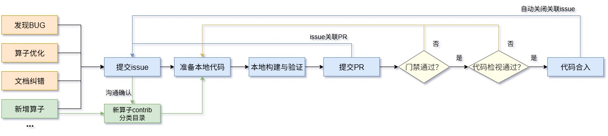

# 贡献指南

## 了解行为准则

ATB属于CANN开放项目，在参与贡献前，请了解[CANN开放项目行为准则](contributors/code-of-conduct.md)，后续您在ATB项目的活动（包括但不限于发表评论、提交Issue、发表wiki等）都请遵循此行为准则。

## 签署CLA

在参与项目贡献前，您需要签署CANN开放项目贡献者许可协议（CLA）。

请根据您的参与身份，选择签署法人CLA、法人贡献者CLA、个人CLA 或企业管理员CLA，请点击[这里](https://clasign.osinfra.cn/sign/68cbd4a3dbabc050b436cdd4)签署。

- 法人CLA：以企业身份参与贡献，代表企业签署CLA，一般由企业管理人员进行签署。
- 法人贡献者CLA：如果您属于签署了法人CLA的企业员工，请申请签署法人贡献者CLA，在申请页面选择您所属的企业，申请后将由企业管理员进行审批，审批完成即可参与贡献。
- 个人CLA：以非企业员工的个人身份参与贡献，请签署个人CLA。
- 企业管理员：以企业管理员的身份参与贡献，请签署企业管理员CLA，企业管理员有权对签署法人贡献者CLA的申请进行审批和人员管理。

## 参与贡献

在签署了CLA协议之后，就可以开始您的贡献之旅啦！贡献的方式有很多种，每一种贡献都将受到欢迎和重视。

所有您发现的问题或想贡献的新想法都可以通过[Issue](#issue-handle)进行反馈、讨论和跟踪，并在后续[贡献编码](#贡献编码) PR 合入后关闭关联Issue。

> 📝 **提示**
>
> - 关于Gitcode工作流的详细操作可参见[Gitcode工作流说明](contributors/gitcode-workflow.md)。
> - 当您在提交PR过程中遇到问题，常见问题的解决方法可参见[FAQs](contributors/infra-faqs.md)。

### 贡献分类

- 算子bug修复
   
  如果您在本仓库中发现了某些算子Bug，并想对其进行修复，欢迎您在仓库中新建Issue进行反馈和跟踪处理。

  您可以按照下方[提交Issue/处理Issue任务](#issue-handle)指引新建 `Bug-Report|缺陷反馈` 类Issue对Bug进行描述，
  然后在评论框中输入“/assign”或“/assign @yourself”将该Issue分配给您进行处理。

- 算子优化
   
  如果您对本仓库中某些算子实现有泛化性增强/性能优化思路，并想着手实现这些优化点，欢迎您对算子进行优化贡献。

  您可以按照下方[提交Issue/处理Issue任务](#issue-handle)指引新建 `Requirement|需求建议` 类Issue对优化点进行说明，并提供您的设计方案，
  然后在评论框中输入“/assign”或“/assign @yourself”将该Issue分配给您进行跟踪优化。

- 贡献新算子
   
  如果您有全新的算子想基于昇腾芯片进行设计实现，欢迎您在Issue中提出新的想法和设计，并与昇腾团队成员进行交流讨论。

  您可以按照下方[提交Issue/处理Issue任务](#issue-handle)指引新建 `Requirement|需求建议` 类Issue提供您的新算子说明和设计方案，
  昇腾团队成员会与您进行沟通确认，并为您的算子提供一个合适的`contrib`目录分类，您可以将您的新算子贡献到对应分类目录下。

  同时，您需要在提交的Issue中评论“/assign”或“/assign @yourself”，认领该Issue并在后续完成新算子上库。

- 文档纠错
   
  如果您在仓库中发现某些算子文档描述错误，欢迎您在仓库中新建Issue进行反馈和修复。

  您可以按照下方[提交Issue/处理Issue任务](#issue-handle)指引新建 `Documentation|文档反馈` 类Issue指出对应文档中的问题，
  然后在评论框中输入“/assign”或“/assign @yourself”将该Issue分配给您纠正对应文档描述。

- 帮助解决他人Issue
   
  如果社区中他人遇到的问题您有合适的解决方法，欢迎您在Issue中发表评论交流，帮助他人解决问题和痛点，共同优化易用性。

  如果对应Issue需要进行代码修改，您可以在Issue评论框中输入“/assign”或“/assign @yourself”将该Issue分配给您，跟踪协助解决问题。

<h3 id="issue-handle">提交Issue/处理Issue任务</h3>

- 找到Issue列表：
  
  在[ATB](https://gitcode.com/cann/ascend-transformer-boost)项目Gitcode主页内，点击“Issues”，即可找到 Issue 列表。

- 提交Issue
  
  如果您准备向社区上报Bug或者提交需求，或者为社区贡献自己的意见或建议，请提交Issue。

  提交Issue请参考 [Issue 提交指南](contributors/issue-submit.md)。

- 参与Issue讨论

  每个Issue下面都支持开发者们交流讨论，如果您感兴趣，可以在评论区中发表自己的意见。

- 找到愿意处理的Issue

  如果您愿意处理其中的一个 Issue，可以将它分配给自己。只需要在评论框内输入“/assign”或 “/assign @yourself”，机器人就会将问题分配给您，您的名字将显示在负责人列表里。

### 贡献编码

1. 准备CANN开发环境
  
   如果您想参与编码贡献，需要准备CANN开发环境，请参考[环境准备](../README.md#二环境构建)。

2. 了解ATB的开发注意事项

   1）请参考[工具版本要求与安装](../README.md#基础工具版本要求与安装)，了解编码贡献的一些环境和工具要求。

   2）ATB软件编码遵循许可协议：CANN Open Software License Agreement Version 2.0，详细的协议说明请参见[LICENSE](../LICENSE)文件，如果您贡献代码到ATB源码仓，请遵循此协议。
   
      请在新建的cpp、cc、h等源码文件头部增加如下声明：
    
      ```cpp
     /**
      * Copyright (c) [Name of the copyright owner]. 2025. All rights reserved.
      * This program is free software, you can redistribute it and/or modify it under the terms and conditions of
      * CANN Open Software License Agreement Version 2.0 (the "License").
      * Please refer to the License for details. You may not use this file except in compliance with the License.
      * THIS SOFTWARE IS PROVIDED ON AN "AS IS" BASIS, WITHOUT WARRANTIES OF ANY KIND, EITHER EXPRESS OR IMPLIED,
      * INCLUDING BUT NOT LIMITED TO NON-INFRINGEMENT, MERCHANTABILITY, OR FITNESS FOR A PARTICULAR PURPOSE.
      * See LICENSE in the root of the software repository for the full text of the License.
      */
      ```
      
      请在新建的py、sh等文件头部增加如下声明：
      
      ```sh
     # Copyright (c) [Name of the copyright owner]. 2025. All rights reserved.
     # This program is free software, you can redistribute it and/or modify it under the terms and conditions of
     # CANN Open Software License Agreement Version 2.0 (the "License").
     # Please refer to the License for details. You may not use this file except in compliance with the License.
     # THIS SOFTWARE IS PROVIDED ON AN "AS IS" BASIS, WITHOUT WARRANTIES OF ANY KIND, EITHER EXPRESS OR IMPLIED,
     # INCLUDING BUT NOT LIMITED TO NON-INFRINGEMENT, MERCHANTABILITY, OR FITNESS FOR A PARTICULAR PURPOSE.
     # See LICENSE in the root of the software repository for the full text of the License.
     # ================================================================================================================
     ```

    - 如果您仅代表个人贡献，并且您个人拥有贡献内容的版权，请将第一行中的 `[Name of the copyright owner]` 替换为您的署名。
    - 如果您代表您的雇主贡献，或者您的雇主拥有您贡献内容的版权，请将第一行中的 `[Name of the copyright owner]` 替换为您的雇主的名称。
      
      如果您对于贡献内容的版权归属存在任何疑问，请您咨询法律顾问或您雇主的法律团队。
      
    - 第一行中`2025`为您创建或修改该文件的年份，请根据实际时间修改。

3. 代码下载与贡献流程

  
### 3.1 开发与提交流程

  (1) 进行代码开发前，请先将需要ATB仓库fork到个人仓，然后将个人仓下载到本地。并在本地分支进行代码修改。  
  (2) 参考[从开发一个简单算子出发](从开发一个简单算子出发.md)或[开发指南](开发指南.md)文档，进行ATB算子开发、本地构建与验证。  
  (3) 提交PR前，请先在fork仓中将 `@AtlasAccount` 和 `@openLiBingCI` 添加为成员，权限至少设置为开放者及以上。  
  (4) 提交PR前，请先确认对应的Issue；如果没有对应Issue，请根据Issue模板填写并创建Issue。  
  (5) 代码验证满足贡献要求后，提交Pull-Request，将代码贡献到ATB，在[Pull-Request列表](https://gitcode.com/cann/ascend-transformer-boost/pulls)，可以找到提交的Pull-Request。  


### 3.2 PR 合入门禁（必须满足）

**必须具备的标签**：`cann-cla/yes`、`ci-pipeline-passed`、`SC-SUCC`、`lgtm`、`approved`

**禁止存在的标签**：`cann-cla/no`、`ci-pipeline-failed`、`SC-FAIL`、`needs-issue`

**检视意见要求**：PR 中所有检视意见/讨论必须全部处理完成（无未解决意见）。

### 3.3 标签获取与删除指引

- 获取 `cann-cla/yes` 标签并移除 `cann-cla/no` 标签：用于标识 CLA 校验通过。若 PR 当前没有 `cann-cla/yes` 或存在 `cann-cla/no`，在完成 CLA 签署并确认提交邮箱匹配后，必须在 PR 评论区执行 `/check-cla` 刷新 CLA 校验结果；校验通过后移除 `cann-cla/no` 并获得 `cann-cla/yes`。

- 移除 `needs-issue` 标签：PR 创建后如果出现 `needs-issue`，说明当前 PR 没有关联 Issue，请先将 PR 关联到对应 Issue，再在 PR 评论区执行 `/check-issue` 让机器人重新校验；校验通过后该标签会被移除。

- 获取 `ci-pipeline-passed` 标签并移除 `ci-pipeline-failed` 标签：主流水线通过评论`compile` 触发，通过后获得 `ci-pipeline-passed`，未通过获得 `ci-pipeline-failed`。`ci-pipeline-passed` 标签获得后有 72 小时时效，之后将被删除，请重新评论 `compile` 获取。若当前未通过，请按日志修复问题后在 PR 评论区执行 `compile` 重新触发主流水线；

- 获取 `SC-SUCC` 标签并移除 `SC-FAIL` 标签：协同任务通过评论 `compile#openlibing` 触发，通过后获得 `SC-SUCC`，失败后获得 `SC-FAIL`。若当前未通过，请按协同任务日志修复后在 PR 评论区执行 `compile#openlibing` 重新触发协同任务。

- 获取 `lgtm` 标签：处理并回复完所有检视意见后，在评论区输入如下内容，并说明需要 `lgtm` 标签，由检视者确认代码质量后添加。

  ```text
  @QK_25415 @nino888 @goodpeople233 looking for lgtm检视
  ```

- 获取 `approved` 标签：在技术问题、流程标签和检视意见全部闭环后，在评论区输入如下内容，并说明需要 `approved` 标签，由有权限的检视者最终确认后添加。

  ```text
  @QK_25415 @nino888 @goodpeople233 looking for approved检视
  ```

### 3.4 合入与关闭

满足以上条件后，PR 将自动合入；请注意及时确认问题已解决，并关闭对应 Issue。
